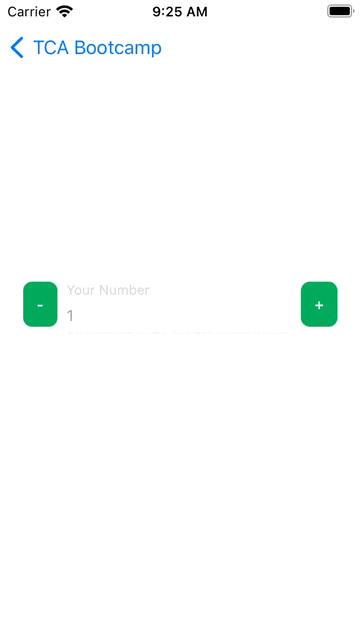
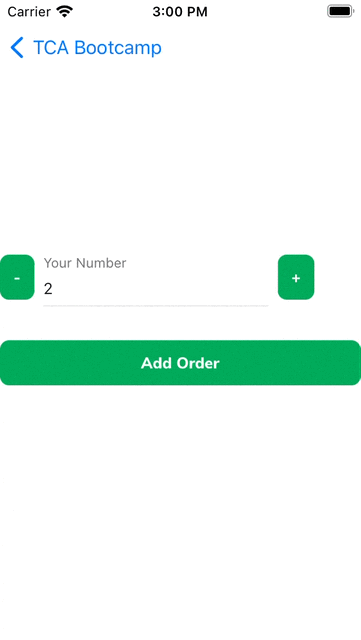
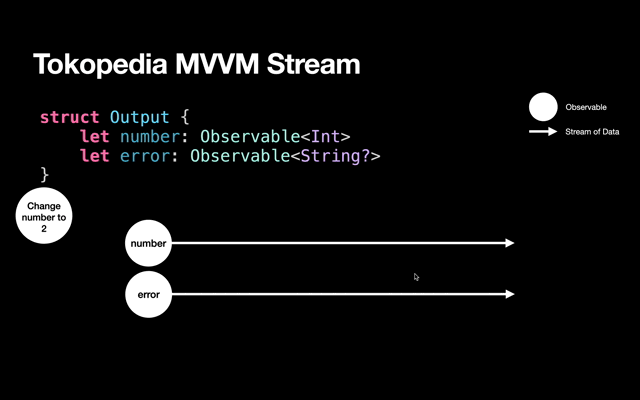
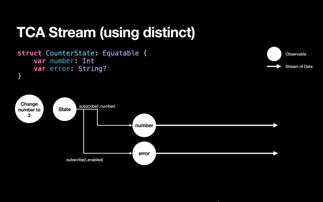
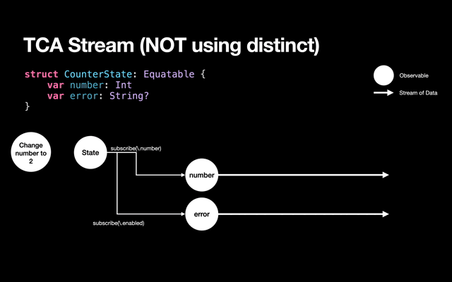

# Day 1: The basics: State, Action, Side Effect, Environment

Pre-Bootcamp
Please checkout to this branch: `bootcamp`

Generate project: 
```
tools/tulsi_generate.sh ios/TCABootcamp/TCABootcampExample ios/TCABootcamp/TCABootcampTests
```

## Overview
In this lesson, you'll learn how to use:
- State 
- Action
- Side Effect & Environment

[Slides](https://www.icloud.com/keynote/0e4wY65J0Qlt8s86UX6kKpomw#TCA_Bootcamp)

## Quantity Editor for Order


VC: `CounterVC.swift`

Reducer: `CounterVC+Reducer.swift`

### Exercise 1: Disable on Minus Button
We want to make sure the quantity cannot be negative, so at the first run, we will disabled the minus button if the number <= 0.



There are 2 ways to do achieve the requirement.

The first one is by adding a new property in the State:
```swift
struct CounterState: Equatable {
    var number: Int
    var isMinusButtonEnabled: Bool = false
}
```
In the reducer, we add a new check when user tap the minus button:
```swift
switch action {
case .didTapMinus:
    state.number -= 1
    state.isMinusButtonEnabled = state.number > 0
    return .none
case .didTapPlus:
    state.number += 1
    state.isMinusButtonEnabled = state.number > 0
    return .none
}
```

Run the app and you notice a strange behavior, because we first open the page, the number is set to 1, and the `isMinusButtonEnabled` is default to `false`.

Can someone give idea to fix this issue? 🙋🏻‍♂️

... (continue giving options)

To fix this we can use custom initialization on the `CounterState`:
```swift
struct CounterState: Equatable {
    var number: Int
    var isMinusButtonEnabled: Bool

    init(number: Int) {
    	self.number = number
    	self.isMinusButtonEnabled = number > 0
    }
}
```

The bug is gone 😃, but maybe some of you will think, this is not a DRY(don't repeat yourself), we repeat the `isMinusButtonEnabled = state.number > 0` 3 times!
You can refactor it to a function or maybe use `didSet` to watch whenever the `number` is changed. 
```swift
var number: Int {
    didSet {
        isMinusButtonEnabled = number > 0
    }
}
```

But remember, the `didSet` will NOT get called on initialization. so you need to do the check when in first init.
```swift
struct CounterState: Equatable {
    var number: Int {
        didSet {
            setMinusEnabledStatus()
        }
    }
    var isMinusButtonEnabled: Bool = false

    init(number: Int) {
        self.number = number
        setMinusEnabledStatus()
    }
    
    mutating func setMinusEnabledStatus() {
        self.isMinusButtonEnabled = number > 0
    }
}
```

The other approach is by leveraging the swift computed property 👍🏻
```swift
struct CounterState: Equatable {
    var number: Int
    var isMinusButtonEnabled: Bool { number > 0 }
}
```
By using computed property, there is no repeatition on the code. Usually we used computed property in TCA only if the property is just derived from the other property (in this case the enabled/disabled status is derived from the `number` property).

Next, let's re-run the test.
Strangely the test still green ✅ even though we add new property.
Why???
This is because computed properties are get only property, so you can't set into it. For example like this:

```swift
func testTapPlus() {
    // let testStore = ...
    
    testStore.send(.didTapPlus) {
        $0.isMinusButtonEnabled = false
    }
}
```

You'll get this error:
```
❌ Cannot assign to property: 'isMinusButtonEnabled' is a get-only property
```

To test this, you can use usual XCTAssert like this:
```swift
testStore.send(.didTapPlus) {
    XCTAssertTrue($0.isMinusButtonEnabled)
}
```

But that could be repetitive, for example when you tapMinus, to make sure that the value is correct, you add the similar code to assert the `isMinusButtonEnabled`.

The better way to test this, is by testing the plain state without involving the TCA.
```swift
func testEnabledMinusButton() {
    var state = CounterState(number: 1)
    
    XCTAssertTrue(state.isMinusButtonEnabled)
    
    state.number = 0
    
    XCTAssertFalse(state.isMinusButtonEnabled)
}
```

⚠️ Don't abuse computed property ⚠️

There are some cons of computed property which are:
1. The code can't join the Exhaustive test on TCA TestStore (as it's getter only)
2. Can only observe the `State`. If the value is derived from other things (e.g. the Environment), you can't use computed property. 

### Exercise 2: Enable Text Input & Add Error Message


Next, we will enable keyboard input on the `TextFieldNode`. You can remove the `isEnabled = false` on `TextFieldNode`.
Then you can listen to the text changed and send it as action to the reducer.
```swift
enum CounterAction: Equatable {
    // ...
    case textDidChange(String)
}

func bindAction() {
    // ...
    textFieldNode.rx.text
        .asDriver()
        .drive(onNext: { [store] text in
            store.send(.textDidChange(text))
        })
        .disposed(by: rx.disposeBag)
}

// Reducer
case let .textDidChange(string):
    state.number = Int(string) ?? 0
```

Because the number type is `Int`, we need to only allow numeric type, if the input is invalid, we will add `errorMessage` that will shown to the user as TextField's `errorMessage` property.

```swift
struct CounterState {
    var errorMessage: String?
}

// Reducer
case let .textDidChange(string):
    if let number = Int(string) {
        state.number = number
        state.errorMessage = state.number < 0 ? "Error, should >= 0" : nil
    } else {
        state.number = 0
        state.errorMessage = "Should only contains numeric"
    }
    return .none
```

Run the app, and if you try it, you may find a bug related to the errorMessage, which is in case when you are typing negative value e.g. -2, and then using paste, change to another negative value (such as -1), the errorMessage is gone!

Why this happen? We never make the `errorMessage` property to nil 🤔
Turns out, TextFieldNode will reset the errorMessage everytime you change the text behind the scene. This lead to problem on UI that is out of sync from the state which is our source of truth.

But don't worry, we have added a `shouldResetErrorMessageAfterTyping` property to cater this problem, please set it to `false`, so the `TextFieldNode` will not reset the `errorMessage` without our consent (our State).

Every number change, we need to check the number error state. Please add below code on every action that mutate the `number`.

```swift
state.errorMessage = state.number < 0 ? "Error, should >= 0" : nil
```

This is not good, we repeat everytime we change the number. But we can't use computed property because we have 2 cases on showing errorMessage, valid 0 will not returning error, but 0 because of invalid non numeric should show the error.

We will give several ways to fix this:
1. Using side effect ❌
```swift
enum CounterAction {
    // ...
    case checkNumber
}

// Reducer
let counterReducer = Reducer<CounterState, CounterAction, Void> { state, action, env in
    switch action {
    case .didTapMinus:
        state.number -= 1
        return Effect(value: .checkNumber)
    case .didTapPlus:
        state.number += 1
        return Effect(value: .checkNumber)
    case let .textDidChange(string):
        if let number = Int(string) {
            state.number = number
            return Effect(value: .checkNumber)
        } else {
            state.number = 0
            state.errorMessage = "Should only contains numeric"
            return .none
        }
    case .checkNumber:
        state.errorMessage = state.number < 0 ? "Error, should >= 0" : nil
        return .none
    }
}
```

There is no more repeatition, next, lets fix the unit test.
```swift
func testTapPlus() {
    let testStore = TestStore(
        initialState: CounterState(number: 1),
        reducer: counterReducer,
        environment: ()
    )

    testStore.send(.didTapPlus) {
        $0.number = 2
        XCTAssertTrue($0.isMinusButtonEnabled)
    }
    testStore.receive(.checkNumber)
}

func testChangeTextToNonNumeric() {
    let testStore = TestStore(
        initialState: CounterState(number: 1),
        reducer: counterReducer,
        environment: ()
    )

    testStore.send(.textDidChange("a")) {
        $0.number = 0
        $0.errorMessage = "Should only contains numeric"
    }
}
```

The problem of this approach is the test will have lots of .receive noise. This will make our test less readable by other devs, maybe for this simple case, it still readable, but in more complex case, it can make your test flow more difficult to read. Naturally, the action should represent what users do and side effects. If you read the test above, it's readed like: user tapPlus, then user check the number, which is incorrect.

Let's move to the next approach:

2. Inline function ✅
Next approach is by using function that live inside the reducer. 
```swift
let counterReducer = Reducer<CounterState, CounterAction, Void> { state, action, _ in
    func validateNumber() {
        state.errorMessage = state.number < 0 ? "Error, should >= 0" : nil
    }
    switch action {
    case .didTapMinus:
        state.number -= 1
        validateNumber()
        return .none
    // ...
    }
```

The refactor is still the same, you only need to call the function, but there is no need to return it as side effect.

So our test will be more straightforward, you can remove all the `checkNumber` side effects.

```swift
func testChangeToNegativeByButton() {
    let testStore = TestStore(
        initialState: CounterState(number: 1),
        reducer: counterReducer,
        environment: ()
    )

    testStore.send(.textDidChange("-2")) {
        $0.number = -2
        $0.errorMessage = "Error, should >= 0"
    }
    testStore.send(.didTapPlus) {
        $0.number = -1
        $0.errorMessage = "Error, should >= 0"
    }
}
```

This approach are widely used because you can still use the environment.

The last approach is by creating a function inside the State itself.

3. State function ✅
```swift
struct CounterState {
    // ..

    mutating func validateNumber() {
        errorMessage = number < 0 ? "Error, should >= 0" : nil
    }
}

// Reducer
state.validateNumber()
```

By using this style, you can call it on other place that uses this State (for example if you need to call it on other reducers), but you can't use environment (if you need to you can still pass it as the function argument).

## Environment
Lets go to the next topic, Environment. This is the entry point to the outside world and how to control the world for mocking and unit testing. Usually we put all things that we can't control in the Environment.

```swift
struct DemoEnvironment {
    var loadData: () -> Effect<Result<Int, NetworkError>>
}
```

The use cases of Environment is very wide coverage. From network request, apple system framework such as getting the state of user notification permission, and even `Date`. 

Lets open `DemoEnvironmentVC+Reducer.swift` file and see whats inside.

```swift
struct DemoEnvironment {
    var loadData: () -> Effect<Result<Int, CustomError>>
    var trackEvent: (String) -> Effect<Never>
    var date: () -> Date
    var uuid: () -> UUID
}
```

You can initialize the Environment using static var.
```swift
extension DemoEnvironment {
    static let live = Self(
        loadData: {
            Observable.just(Result.success(Int.random(in: 0 ... 10000)))
                .delay(.milliseconds(500), scheduler: MainScheduler.instance)
                .eraseToEffect()
        },
        trackEvent: { event in
            .fireAndForget {
                print("TrackEvent \(event)")
            }
        },
        date: Date.init,
        uuid: UUID.init
    )
}
```

Let see the property 1 by 1:
1. `loadData`: it's a network request to the server that will return a random number, we need to put it into the environment so we can freely change the result both in the development and unit test.
2. `trackEvent`: It's better to not to track when unit testing.
3. `date`: Maybe you ask, why need to put the Date in the environment? If you see the previous description of Environment, "we put all that we can't control", Date is the same, everytime you run `Date()`, it will generate different timestamp.
4. `uuid`: Same with date.

There are 2 types of Environment, which is direct (date, uuid) and non direct using Effect (loadData, trackEvent).

When using direct, you can just called it like regular function, e.g:
```swift
env.date()
env.uuid()
```

When using non-direct env, you need to uses it as the return value of the reducer. e.g:

```swift
enum Action {
    case didLoad
    case receiveData(Result<Int, CustomError>)
}

// Reducer
case .didLoad:
    env.loadData()
    .map(Action.receiveData) // or .map { Action.receiveData($0) }
```

If you don't care of return value of the environment (like `trackEvent`), you can use `.fireAndForget()` helper.

```swift
case .didTapSubmit:
    return env.trackEvent("didSubmit")
        .fireAndForget()
```

When you put all the outside world/code that you can't control in the Environment, you can mock it as you wish both during development or testing.
For example, in the test, I want to make sure the Date will always be June 22nd, 2022. you can do that:

```swift
static var mockAlways22June = DemoEnvironment(
    // ...
    date: { Date("22 june 2022") }
    // ...
)
```

and you can plug it when initiatae the `Store`

```swift
let store = Store(
    initialState: EnvironmentState(), 
    reducer: environmentReducer,
    environment: .mockAlways22June
)
```

### Unit Testing the Environment
For the environment, it's recommended to use `.failing` as your base for unit testing

```swift
extension DemoEnvironment {
    static var failing = Self(
        loadData: { Effect.failing("loadData should not called") },
        trackEvent: { _ in Effect.failing("trackEvent Should not be called") },
        date: {
            XCTFail("date Should not be called")
            return Date()
        },
        uuid: {
            XCTFail("date Should not be called")
            return UUID()
        }
    )
}
```

The reason is if you call the environment accidentally in the reducer, the test will failed to alert you that you are calling environment without assert it in the test. For example, when tap the generate UUID button, it will generate the UUID, the test will look like this:

```swift
func testGenerateUUID() {
    let store = TestStore(
        initialState: EnvironmentState(),
        reducer: environmentReducer,
        environment: .failing
    )
    store.environment.uuid = UUID.incrementing
    store.send(.generateUUID) {
        $0.uuidString = "00000000-0000-0000-0000-000000000000"
    }
    store.send(.generateUUID) {
        $0.uuidString = "00000000-0000-0000-0000-000000000001"
    }
}
```

if you forget to implement the environment.uuid, the test will fail 
```
❌ failed - uuid should not be called
```

That alert is good, so you know the reducer will call the `env.uuid`. If you implement the uuid, the test will succeed.

Lets go to another case, when the failing will help you.
Let said someone accidentally copy paste the tracker code into the generateUUID action

```swift
// Reducer, copy paste from generateDate, with modification in the state modification and forget to remove the tracker
case .generateUUID:
    state.uuidString = env.uuid().uuidString
    return env.trackEvent("getCurrentDate").fireAndForget()
```

When the previous test is runned again, the test will fail.
```
❌ trackEvent Should not be called - A failing effect ran.
```

The unit test and failing effect save you from unintended tracker that can caused invalid data to analyze 😇


### Exercise 3: Adding Order


To better understand of using the Environment, let's do some exercise. We will add a create button, that will act as submitting order to the server, the server will return simple `Bool`, when success show the Toast, if failed, show the errorMessage.

First, let add the `CounterEnvironment`

```swift
struct CounterEnvironment {
    var submitOrder: (Int) -> Effect<Bool>
}
```

Then add mock implementation of the Environment.
```swift
static let mockSuccess = Self(
    submitOrder: {
        Effect(value: true)
            .delay(.seconds(1), scheduler: MainScheduler.instance)
            .eraseToEffect()
    }
}

static let mockFailed = Self(
    submitOrder: {
        Effect(value: false)
            .delay(.seconds(1), scheduler: MainScheduler.instance)
            .eraseToEffect()
    }
}
```

Then to show toast, we add new property in the state.
```swift
struct CounterState: Equatable {
    // ...
    var successToastMessage: String?
}
```

We need to add action when tapping the button and receiving side effect.
```swift
enum CounterAction {
    case didTapAddOrder
    case receiveAddOrderResponse(Bool)
}
```

And in the reducer
```swift
case .didTapAddOrder:
    return env.submitOrder(state.number)
        .map(CounterAction.receiveAddOrderResponse)
case let .receiveAddOrderResponse(isSuccess):
    if isSuccess {
        state.successToastMessage = "Order created successfully"
        return .none
    } else {
        state.errorMessage = "Submit Order Failed"
        return .none
    }
```

And update the UI, layout, and binding:

```swift
private let addOrderBtn = ButtonNode(title: "Add Order")
node.layoutSpecBlock = {
    ...
    let mainStack = ASStackLayoutSpec.vertical()
    mainStack.spacing = 8
    mainStack.children = [counterStack, self.addOrderBtn]
    return ASCenterLayoutSpec(centeringOptions: .XY, sizingOptions: .minimumXY, child: mainStack)
}

addOrderBtn.rx.tap
    .asDriver()
    .drive(onNext: { [store] in
        store.send(.didTapAddOrder)
    })
    .disposed(by: rx.disposeBag)

store.subscribe(\.successToastMessage)
    .filterNil()
    .subscribe(onNext: { message in
        Toast.shared.display(message: message)
    })
    .disposed(by: rx.disposeBag)
```

Run the app, and it work gracefully until you try tap the button twice, and you see only 1 toast shown. (hint: this is related to the `distinctUntilChanged` in TCA).

Why this happen? Let's try to debug it 🛠
We can try to debug on the closest code that possibly can cause the issue, which is in subscription when showing the Toast. Let's debug in the UI using infamous `print` statement in the subscription of the number state.

```swift
store.subscribe(\.successToastMessage)
    .filterNil()
    .subscribe(onNext: { message in
        print("<<< \(message)")
        Toast.shared.display(message: message)
    })
    .disposed(by: rx.disposeBag)
```

Run the app, and it only print once. Maybe something wrong with filterNil?, let's try add RxSwift `.debug` before filterNil. Debug will print anything related to that stream.

```swift
store.subscribe(\.successToastMessage)
    .debug("<<<", trimOutput: true)
    .filterNil()
    .subscribe(onNext: { message in
        Toast.shared.display(message: message)
    })
    .disposed(by: rx.disposeBag)
```

Run the example, and filter the log using identifier we provide `<<<`.

```
2022-06-22 15:57:48.121: <<< -> subscribed
2022-06-22 15:57:48.124: <<< -> Event next(nil)
2022-06-22 15:57:52.194: <<< -> Event next(Optional("Order...ated successfully"))
```

It still emitting the value once (please ignore the `nil`). So the problem is not in the UI, maybe it comes from `subscribe`, but before checking in the third party framework, we can add 1 more check in our reducer, maybe there is an issue on our reducer.

Lets try to adding `.debug()` at the end of our reducer.
```swift
let counterReducer = Reducer<CounterState, CounterAction, Void> { 
    // ...
}.debug()
```

In the log you can see all the action send and the state that changed to the reducer 
```
received action:
  CounterAction.didTapAddOrder
  (No state changes)

received action:
  CounterAction.didTapAddOrder
  (No state changes)

received action:
  CounterAction.receiveAddOrderResponse(
    true
  )
  CounterState(
    number: 2,
    errorMessage: nil,
−   successToastMessage: nil
+   successToastMessage: "Order created successfully"
  )

received action:
  CounterAction.receiveAddOrderResponse(
    true
  )
  (No state changes)
```

From the Xcode console log, we get 2 `receiveAddOrderResponse`, why the toast only shown once 🤔? 

We only see 1 value being emitted which you might thing this is strange. 

Don't worry, we will explain why this happen. 
Let's deep dive about how the TCA subscription works compare to our MVVM.



In MVVM, each output has its own Observable, so everytime you send (onNext) on it, it will produce new stream.



On contrary, TCA has 1 single Observable which is the `State`. So it needs to do the distinct (using `distinctUntilChanged`) so it will emit new value when it's not equal.

That's explains why when the value is still the same, the subscription will not emit new `onNext` value.

Maybe some of you still questioning, why TCA need the distinction.
I'll create example flow in case we don't use distinct in the TCA subscription.



As you can see, everytime the State change, it will emit to all the part of the subscription, eventhough we don't touch the property in the reducer. It causes unnecessary subscription emit and run.

As we approaching the Declarative UI, this is what we need to think, as State will be our source of truth, then if the value is same, we'll not do anything.

The problem arise because we are using the UIKit/Texture that are still imperative. There is some ways to fix this problem:

First option: we reset the state after we set it (this is what devs usually do until now)

```swift
case let .receiveAddOrderResponse(isSuccess):
        if isSuccess {
            state.successToastMessage = "Order created successfully"
            return Effect(value: .dismissToast)
        } else {
            state.errorMessage = "Submit Order Failed"
            return .none
        }
    }
case .dismissToast:
    state.successToastMessage = nil
    return .none
```

or we add new callback to support TCA declarative syntax in the Toast.

```swift
Toast.shared.display(message: message, onDismiss: {
    store.send(.dismissToast)
})
```

Using this sometimes can be cumbersome, you need to do this manually just to reset the state.

Second option: Use `NeverEqual` Property Wrapper
`NeverEqual` is created to cater the problem above. Behind the scene, everytime you set to new value, whether it's same or not, internally it will increment the number so it'll not equal.

Let's change the number state to use NeverEqual property wrapper.

```swift
@NeverEqual var successToastMessage: String?
```

and change the subscription using `subscribeNeverEqual`:
```swift
store.subscribeNeverEqual(\.$successToastMessage)
    .subscribe(onNext: ...)
```

Using `NeverEqual`, there is no need to reset the state just to avoid the value is not being emit because it has the same value.

Rerun the example, and it fixed the problem. 

⚠️ Remember, this property wrapper should rarely being used, you can discuss with other members/PE to decide whenever your case is suite to use NeverEqual or can uses another approach ⚠️

The last option, because the Toast is not depend to our UI, we can move the toast implementation into the Environment.

```swift
struct CounterEnvironment {
    var submitOrder: (Int) -> Effect<Bool>
    var showToast: (String) -> Effect<Never>
}

static let mockSuccess = Self(
    // ...
    showToast: { message in
        .fireAndForget {
            Toast.shared.display(message: message)
        }
    }
)
```

When success creating order you can call it like this:
```swift
case let .receiveAddOrderResponse(isSuccess):
    if isSuccess {
        return env.showToast("Order created successfully")
            .fireAndForget()
    }
```

When using this approach, maybe you can think the Toast as our dependency, we don't create the toast, we only using it.

The environment approach can't or will be difficult to be used if the Toast need reference to the UI (such as positioning the toast above X node).

I suggest you guys to use the environment as the first option when you are getting this problem.