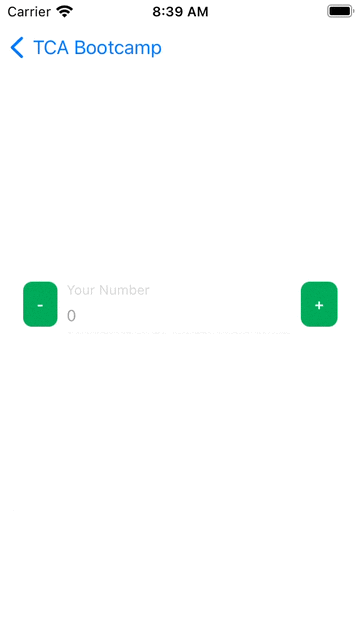

# Day 1: The basics: State, Action, Side Effect, Environment

Pre-Bootcamp
Please checkout to this branch: `bootcamp`
Generate project: 
```
tools/tulsi_generate.sh ios/TCABootcamp/TCABootcampExample ios/TCABootcamp/TCABootcampTests
```

Slides: https://www.icloud.com/keynote/0e4wY65J0Qlt8s86UX6kKpomw#TCA_Bootcamp

## Quantity Editor for Order


VC: `CounterVC.swift`
Reducer: `CounterVC+Reducer.swift`