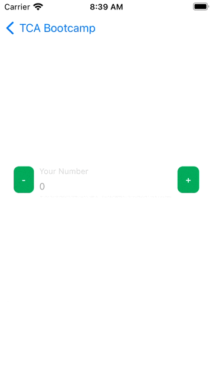
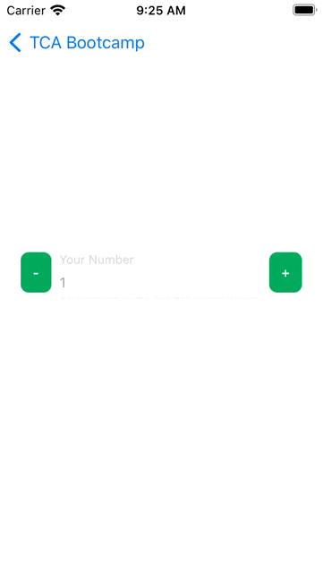
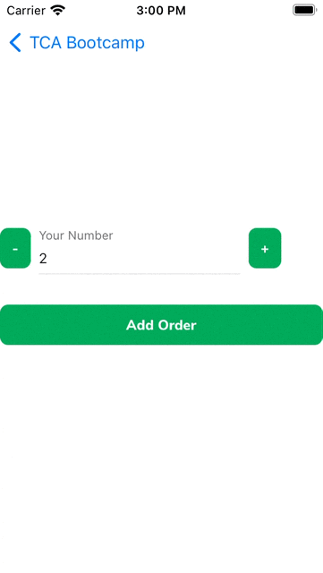
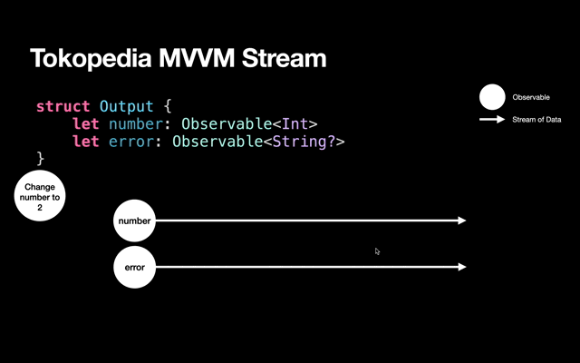
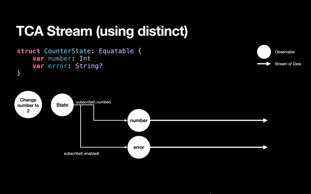
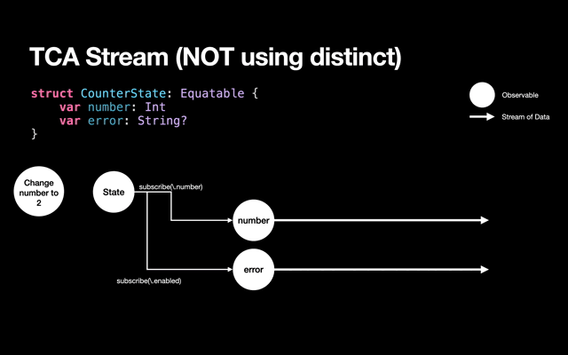
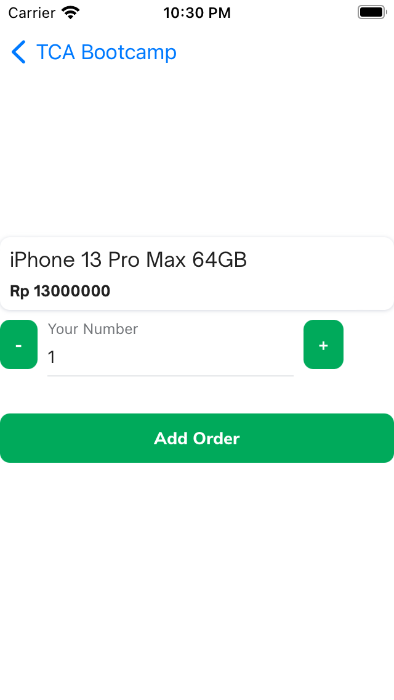
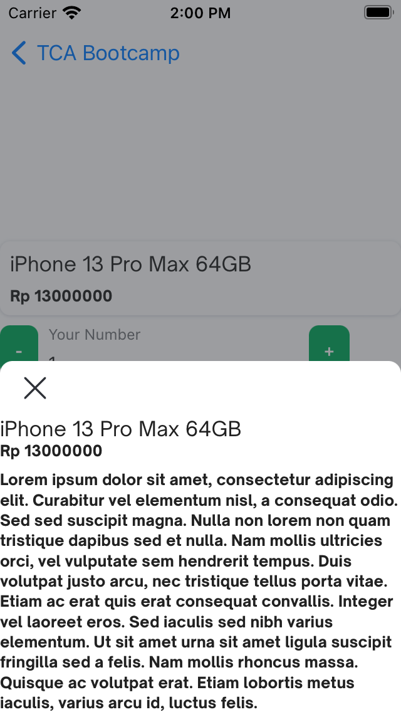

# Day 1: State, Action, Side Effect, Environment

# Table of Contents
1. [Overview](#overview)
2. [Quantity Editor for Order](#quantity-editor-for-order)
3. [Exercise 1: Disable on Minus Button](#exercise-1-disable-on-minus-button)
4. [Exercise 2: Enable Text Input & Add Error Message](#exercise-2-enable-text-input--add-error-message)
5. [Environment](#environment)
6. [Unit Testing the Environment](#unit-testing-the-environment)
7. [Exercise 3: Adding Order](#exercise-3-adding-order)
8. [Scope](#scope)
9. [Exercise 4: Product Info Section](#exercise-4-product-info-section)
10. [IfLet Introduction](#iflet-introduction)
11. [Exercise 5: Show bottom sheet using ifLet](#exercise-5-show-bottom-sheet-using-iflet)
12. [Exercise 6: Adding wishlist in the bottom sheet](#exercise-6-adding-wishlist-in-the-bottom-sheet)

## Overview
In this lesson, you'll learn how to use:
- State 
- Action
- Side Effect & Environment
- Scope
- IfLet

[Slides](https://www.icloud.com/keynote/0e4wY65J0Qlt8s86UX6kKpomw#TCA_Bootcamp)

Please checkout to this branch: `bootcamptca-day1/0-start`

Generate project: 
```
tools/tulsi_generate.sh ios/TCABootcamp/TCABootcampExample ios/TCABootcamp/TCABootcampTests
```

The project structure is similar with other modules:
```
TCABootcamp
    TCABootcamp
    TCABootcampExample
    TCABootcampTests
```

The source code of our files is lives inside TCABootcamp/TCABootcamp.
The example is only consist of a ViewController that displayed a table view used only for navigating to our source code.

The standard structure for the feature code is like this:
```
TCABootcamp
    Order
        OrderVC.swift
        OrderVC+Reducer.swift
    MyAccount
        MyAccountVC+Reducer.swift
        MyAccountVC.swift
```

The ViewController and the reducer is inside the same folder. Some of the developers have this structure:
```
TCABootcamp
    Reducer
        OrderVC+Reducer.swift
        MyAccountVC+Reducer.swift
    VC
        OrderVC.swift
        MyAccountVC.swift
```

The problems with the later structure are:
- On code review, the VC and its Reducer counterpart can be far apart in the order.
- When navigating through the Xcode/Your favorite editor's navigation folder, you need to open the Reducer / VC folder to see the counterpart. If you are using the standard structure, it's much easier to navigate the files (as it's grouped by the feature).


## Quantity Editor for Order



VC: `OrderVC.swift`

Reducer: `OrderVC+Reducer.swift`

## Exercise 1: Disable on Minus Button
We want to make sure the quantity can't be negative, so at the first run, we will disabled the minus button if the number <= 0.



There are two ways to achieve the requirement above.

The first one is by adding a new property in the State:
```swift
struct OrderState: Equatable {
    var number: Int
    var isMinusButtonEnabled: Bool = false
}
```
In the reducer, we add a new check when user tap the minus button:
```swift
switch action {
case .didTapMinus:
    state.number -= 1
    state.isMinusButtonEnabled = state.number > 0
    return .none
case .didTapPlus:
    state.number += 1
    state.isMinusButtonEnabled = state.number > 0
    return .none
}
```

You'll notice a strange behavior when running the app, the number is 1, but the `isMinusButtonEnabled` is `false`.

Can someone give idea to fix this issue? 🙋🏻‍♂️

... (continue giving options)

To fix this we can use custom initialization on the `OrderState`:
```swift
struct OrderState: Equatable {
    var number: Int
    var isMinusButtonEnabled: Bool

    init(number: Int) {
        self.number = number
        self.isMinusButtonEnabled = number > 0
    }
}
```

The bug is gone 😃, but maybe some of you will think, this is not a DRY(don't repeat yourself), we repeat the `isMinusButtonEnabled = state.number > 0` 3 times!
You can refactor it to a function or maybe use `didSet` to watch whenever the `number` is changed. 
```swift
var number: Int {
    didSet {
        isMinusButtonEnabled = number > 0
    }
}
```

But remember, the `didSet` will NOT get called on initialization. so you need to do the check when in first init.
```swift
struct OrderState: Equatable {
    var number: Int {
        didSet {
            setMinusEnabledStatus()
        }
    }
    var isMinusButtonEnabled: Bool = false

    init(number: Int) {
        self.number = number
        setMinusEnabledStatus()
    }
    
    mutating func setMinusEnabledStatus() {
        self.isMinusButtonEnabled = number > 0
    }
}
```

The other approach is by leveraging the swift computed property 👍🏻
```swift
struct OrderState: Equatable {
    var number: Int
    var isMinusButtonEnabled: Bool { number > 0 }
}
```
By using computed property, there is no repeatition on the code. Usually we use computed property in TCA only if the property is just derived from the other properties (in this case the enabled/disabled status is derived from the `number` property).

Next, let's re-run the test.
Strangely the test still green ✅ even though we add new property.
Why???
This is because computed properties are get only property, so you can't set into it. For example like this:

```swift
func testTapPlus() {
    // let testStore = ...
    
    testStore.send(.didTapPlus) {
        $0.isMinusButtonEnabled = false
    }
}
```

You'll get this error:
```
❌ Cannot assign to property: 'isMinusButtonEnabled' is a get-only property
```

To test this, you can use usual XCTAssert like this:
```swift
testStore.send(.didTapPlus) {
    XCTAssertTrue($0.isMinusButtonEnabled)
}
```

But that could be repetitive, for example when you tapMinus, to assure that the value is correct, you add the similar code to assert the `isMinusButtonEnabled`.

The better way to test this, is by testing the plain state without involving the TCA.
```swift
func testEnabledMinusButton() {
    var state = OrderState(number: 1)
    
    XCTAssertTrue(state.isMinusButtonEnabled)
    
    state.number = 0
    
    XCTAssertFalse(state.isMinusButtonEnabled)
}
```

⚠️ Don't abuse computed property ⚠️

There are some cons of computed property which are:
1. The code can't join the Exhaustive test on TCA TestStore (as it's getter only)
2. Can only observe the `State`. If the value is derived from other things (e.g. the Environment), you can't use computed property. 

## Exercise 2: Enable Text Input & Add Error Message

Starting Branch: `bootcamptca-day1/1-exercise2_starting_point`


Next, we will enable keyboard input on the `TextFieldNode`. You can remove the `isEnabled = false` on `TextFieldNode`.
Then you can listen to the text changed and send it as action to the reducer.
```swift
enum OrderAction: Equatable {
    // ...
    case textDidChange(String)
}

func bindAction() {
    // ...
    textFieldNode.rx.text
        .asDriver()
        .drive(onNext: { [store] text in
            store.send(.textDidChange(text))
        })
        .disposed(by: rx.disposeBag)
}

// Reducer
case let .textDidChange(string):
    state.number = Int(string) ?? 0
```

We only allow numeric type because the number type is `Int`. If the input is invalid, we will add `errorMessage` that will shown to the user as TextField's `errorMessage` property.

```swift
struct OrderState {
    var errorMessage: String?
}

// Reducer
case let .textDidChange(string):
    if let number = Int(string) {
        state.number = number
        state.errorMessage = state.number < 0 ? "Error, should >= 0" : nil
    } else {
        state.number = 0
        state.errorMessage = "Should only contains numeric"
    }
    return .none
```

Run the app, and if you try it, you may find a bug related to the errorMessage, which is in case when you are typing negative value e.g. -2, and then using paste, change to another negative value (such as -1), the errorMessage is gone!

Why this happen? We never make the `errorMessage` property to nil 🤔
Turns out, TextFieldNode will reset the errorMessage everytime you change the text behind the scene. This lead to problem on UI that is out of sync from the state which is our source of truth.

But don't worry, we have added a `shouldResetErrorMessageAfterTyping` property to cater this problem, please set it to `false`, so the `TextFieldNode` will not reset the `errorMessage` without our consent (our State).

Every number change, we need to check the number error state. Please add below code on every action that mutate the `number`.

```swift
state.errorMessage = state.number < 0 ? "Error, should >= 0" : nil
```

This is not good, we repeat everytime we change the number. But we can't use computed property because we have 2 cases on showing errorMessage, valid 0 will not returning error, but 0 because of invalid non numeric should show the error.

We will give several ways to fix this:
1. Using side effect ❌
```swift
enum OrderAction {
    // ...
    case checkNumber
}

// Reducer
let orderReducer = Reducer<OrderState, OrderAction, Void> { state, action, env in
    switch action {
    case .didTapMinus:
        state.number -= 1
        return Effect(value: .checkNumber)
    case .didTapPlus:
        state.number += 1
        return Effect(value: .checkNumber)
    case let .textDidChange(string):
        if let number = Int(string) {
            state.number = number
            return Effect(value: .checkNumber)
        } else {
            state.number = 0
            state.errorMessage = "Should only contains numeric"
            return .none
        }
    case .checkNumber:
        state.errorMessage = state.number < 0 ? "Error, should >= 0" : nil
        return .none
    }
}
```

There is no more repeatition, next, lets fix the unit test.
```swift
func testTapPlus() {
    let testStore = TestStore(
        initialState: OrderState(number: 1),
        reducer: orderReducer,
        environment: ()
    )

    testStore.send(.didTapPlus) {
        $0.number = 2
        XCTAssertTrue($0.isMinusButtonEnabled)
    }
    testStore.receive(.checkNumber)
}

func testChangeTextToNonNumeric() {
    let testStore = TestStore(
        initialState: OrderState(number: 1),
        reducer: orderReducer,
        environment: ()
    )

    testStore.send(.textDidChange("a")) {
        $0.number = 0
        $0.errorMessage = "Should only contains numeric"
    }
}
```

The problem of this approach is the test will have lots of .receive noise. IT will make our test less readable by other devs, maybe for this simple case, it still readable, but in more complex case, it can make your test flow more difficult to read. Naturally, the action should represent what users do and side effects. If you read the test above, it's readed like: user tapPlus, then user check the number, which is incorrect.

Let's move to the other approach:

2. Inline function ✅

Next approach is by using function that live inside the reducer. 
```swift
let orderReducer = Reducer<OrderState, OrderAction, Void> { state, action, _ in
    func validateNumber() {
        state.errorMessage = state.number < 0 ? "Error, should >= 0" : nil
    }
    switch action {
    case .didTapMinus:
        state.number -= 1
        validateNumber()
        return .none
    // ...
    }
```

The refactor is still the same, you only need to call the function, but there is no need to return it as side effect.

So our test will be more straightforward, you can remove all the `checkNumber` side effects.

```swift
func testChangeToNegativeByButton() {
    let testStore = TestStore(
        initialState: OrderState(number: 1),
        reducer: orderReducer,
        environment: ()
    )

    testStore.send(.textDidChange("-2")) {
        $0.number = -2
        $0.errorMessage = "Error, should >= 0"
    }
    testStore.send(.didTapPlus) {
        $0.number = -1
        $0.errorMessage = "Error, should >= 0"
    }
}
```

This approach is more common to use because you can still use the environment.

The last approach is by creating a function inside the State itself.

3. State function ✅
```swift
struct OrderState {
    // ..

    mutating func validateNumber() {
        errorMessage = number < 0 ? "Error, should >= 0" : nil
    }
}

// Reducer
state.validateNumber()
```

By using this style, you can call it on other place that uses this State (for example, if you need to call it on other reducers), but you can't use environment (You can still pass it as the function argument actually).

## Environment

Starting Branch: `bootcamptca-day1/2-exercise3_starting_point`

Lets go to the next topic, Environment. It is the entry point to the outside world and how to control the world for mocking and unit testing. Usually we put all things that we can't control in the Environment.

```swift
struct DemoEnvironment {
    var loadData: () -> Effect<Result<Int, NetworkError>>
}
```

The use cases of Environment is very broad. From network request, apple system framework such as getting the state of user notification permission, and even `Date`. 

Lets open `DemoEnvironmentVC+Reducer.swift` file and see whats inside.

```swift
struct DemoEnvironment {
    var loadData: () -> Effect<Result<Int, CustomError>>
    var trackEvent: (String) -> Effect<Never>
    var date: () -> Date
    var uuid: () -> UUID
}
```

You can initialize the Environment using static var.
```swift
extension DemoEnvironment {
    static let live = Self(
        loadData: {
            Observable.just(Result.success(Int.random(in: 0 ... 10000)))
                .delay(.milliseconds(500), scheduler: MainScheduler.instance)
                .eraseToEffect()
        },
        trackEvent: { event in
            .fireAndForget {
                print("TrackEvent \(event)")
            }
        },
        date: Date.init,
        uuid: UUID.init
    )
}
```

Let see the property 1 by 1:
1. `loadData`: it's a network request to the server that will return a random number, we need to put it into the environment so we can freely change the result both in the development and unit test.
2. `trackEvent`: It's better to not to track when unit testing.
3. `date`: Maybe you ask, why need to put the Date in the environment? If you see the previous description of Environment, "we put all that we can't control", Date is the same, everytime you run `Date()`, it will generate different timestamp.
4. `uuid`: Same with date.

There are two types of Environment, which is direct (date, uuid) and non direct using Effect (loadData, trackEvent).

When using direct, you can just called it like regular function, e.g:
```swift
env.date()
env.uuid()
```

When using non-direct env, you need to uses it as the return value of the reducer. e.g:

```swift
enum Action {
    case didLoad
    case receiveData(Result<Int, CustomError>)
}

// Reducer
case .didLoad:
    env.loadData()
    .map(Action.receiveData) // or .map { Action.receiveData($0) }
```

If you don't care of return value of the environment (like `trackEvent`), you can use `.fireAndForget()` helper.

```swift
case .didTapSubmit:
    return env.trackEvent("didSubmit")
        .fireAndForget()
```

When you put all the outside world/code that you can't control in the Environment, you can mock it as you wish both during development or testing.
For example, in the test, I want to make sure the Date will always be June 22nd, 2022. you can do that:

```swift
static var mockAlways22June = DemoEnvironment(
    // ...
    date: { Date("22 june 2022") }
    // ...
)
```

and you can plug it when initiatae the `Store`

```swift
let store = Store(
    initialState: EnvironmentState(), 
    reducer: environmentReducer,
    environment: .mockAlways22June
)
```

The convention to mock is always prefix the var with `mock`, so the developers can get to know all mock that availables in the Environment/model just by typing `.mock`, and xcode will help to autocomplete all available mocks.

## Unit Testing the Environment
For the environment, it's recommended to use `.failing` as your base for unit testing

```swift
extension DemoEnvironment {
    static var failing = Self(
        loadData: { Effect.failing("loadData should not called") },
        trackEvent: { _ in Effect.failing("trackEvent Should not be called") },
        date: {
            XCTFail("date Should not be called")
            return Date()
        },
        uuid: {
            XCTFail("date Should not be called")
            return UUID()
        }
    )
}
```

The reason is if you call the environment accidentally in the reducer, the test will failed to alert you that you are calling environment without assert it in the test. For example, when tap the generate UUID button, it will generate the UUID, the test will look like this:

```swift
func testGenerateUUID() {
    let store = TestStore(
        initialState: EnvironmentState(),
        reducer: environmentReducer,
        environment: .failing
    )
    store.environment.uuid = UUID.incrementing
    store.send(.generateUUID) {
        $0.uuidString = "00000000-0000-0000-0000-000000000000"
    }
    store.send(.generateUUID) {
        $0.uuidString = "00000000-0000-0000-0000-000000000001"
    }
}
```

if you forget to implement the environment.uuid, the test will fail 
```
❌ failed - uuid should not be called
```

That alert is good, so you know the reducer will call the `env.uuid`. If you implement the uuid, the test will succeed.

Lets go to another case, when the failing will help you.
Let said someone accidentally copy paste the tracker code into the generateUUID action

```swift
// Reducer, copy paste from generateDate, with modification in the state modification and forget to remove the tracker
case .generateUUID:
    state.uuidString = env.uuid().uuidString
    return env.trackEvent("getCurrentDate").fireAndForget()
```

When the previous test is runned again, the test will fail.
```
❌ trackEvent Should not be called - A failing effect ran.
```

The unit test and failing effect save you from unintended tracker that can caused invalid data to analyze 😇


## Exercise 3: Adding Order
Starting Branch: `bootcamptca-day1/2-exercise3_starting_point`


To better understand of using the Environment, let's do some exercise. We will add a create button, that will act as submitting order to the server, the server will return simple `Bool`, when success show the Toast, if failed, show the errorMessage.

First, let add the `OrderEnvironment`

```swift
struct OrderEnvironment {
    var submitOrder: (Int) -> Effect<Bool>
}
```

Then add mock implementation of the Environment.
```swift
static let mockSuccess = Self(
    submitOrder: {
        Effect(value: true)
            .delay(.seconds(1), scheduler: MainScheduler.instance)
            .eraseToEffect()
    }
}

static let mockFailed = Self(
    submitOrder: {
        Effect(value: false)
            .delay(.seconds(1), scheduler: MainScheduler.instance)
            .eraseToEffect()
    }
}
```

Then to show toast, we add new property in the state.
```swift
struct OrderState: Equatable {
    // ...
    var successToastMessage: String?
}
```

We need to add action when tapping the button and receiving side effect.
```swift
enum OrderAction {
    case didTapAddOrder
    case receiveAddOrderResponse(Bool)
}
```

And in the reducer
```swift
case .didTapAddOrder:
    return env.submitOrder(state.number)
        .map(OrderAction.receiveAddOrderResponse)
case let .receiveAddOrderResponse(isSuccess):
    if isSuccess {
        state.successToastMessage = "Order created successfully"
        return .none
    } else {
        state.errorMessage = "Submit Order Failed"
        return .none
    }
```

And update the UI, layout, and binding:

```swift
private let addOrderBtn = ButtonNode(title: "Add Order")
node.layoutSpecBlock = {
    ...
    let mainStack = ASStackLayoutSpec.vertical()
    mainStack.spacing = 8
    mainStack.children = [counterStack, self.addOrderBtn]
    return ASCenterLayoutSpec(centeringOptions: .XY, sizingOptions: .minimumXY, child: mainStack)
}

addOrderBtn.rx.tap
    .asDriver()
    .drive(onNext: { [store] in
        store.send(.didTapAddOrder)
    })
    .disposed(by: rx.disposeBag)

store.subscribe(\.successToastMessage)
    .filterNil()
    .subscribe(onNext: { message in
        Toast.shared.display(message: message)
    })
    .disposed(by: rx.disposeBag)
```

Run the app, and it work gracefully until you try tap the button twice, and you see only 1 toast shown. (hint: this is related to the `distinctUntilChanged` in TCA).

Why this happen? Let's try to debug it 🛠
We can try to debug on the closest code that possibly can cause the issue, which is in subscription when showing the Toast. Let's debug in the UI using infamous `print` statement in the subscription of the number state.

```swift
store.subscribe(\.successToastMessage)
    .filterNil()
    .subscribe(onNext: { message in
        print("<<< \(message)")
        Toast.shared.display(message: message)
    })
    .disposed(by: rx.disposeBag)
```

Run the app, and it only print once. Maybe something wrong with filterNil?, let's try add RxSwift `.debug` before filterNil. Debug will print anything related to that stream.

```swift
store.subscribe(\.successToastMessage)
    .debug("<<<", trimOutput: true)
    .filterNil()
    .subscribe(onNext: { message in
        Toast.shared.display(message: message)
    })
    .disposed(by: rx.disposeBag)
```

Run the example, and filter the log using identifier we provide `<<<`.

```
2022-06-22 15:57:48.121: <<< -> subscribed
2022-06-22 15:57:48.124: <<< -> Event next(nil)
2022-06-22 15:57:52.194: <<< -> Event next(Optional("Order...ated successfully"))
```

It still emitting the value once (please ignore the `nil`). So the problem is not in the UI, maybe it comes from `subscribe`, but before checking in the third party framework, we can add 1 more check in our reducer, maybe there is an issue on our reducer.

Lets try to adding `.debug()` at the end of our reducer.
```swift
let orderReducer = Reducer<OrderState, OrderAction, Void> { 
    // ...
}.debug()
```

In the log you can see all the action send and the state that changed to the reducer 
```
received action:
  OrderAction.didTapAddOrder
  (No state changes)

received action:
  OrderAction.didTapAddOrder
  (No state changes)

received action:
  OrderAction.receiveAddOrderResponse(
    true
  )
  OrderState(
    number: 2,
    errorMessage: nil,
−   successToastMessage: nil
+   successToastMessage: "Order created successfully"
  )

received action:
  OrderAction.receiveAddOrderResponse(
    true
  )
  (No state changes)
```

From the Xcode console log, we get 2 `receiveAddOrderResponse`, why the toast only shown once 🤔? 

We only see 1 value being emitted which you might thing this is strange. 

Don't worry, we will explain why this happen. 
Let's deep dive about how the TCA subscription works compare to our MVVM.



In MVVM, each output has its own Observable, so everytime you send (onNext) on it, it will produce new stream.



On contrary, TCA has 1 single Observable which is the `State`. So it needs to do the distinct (using `distinctUntilChanged`) so it will emit new value when it's not equal.

That's explains why when the value is still the same, the subscription will not emit new `onNext` value.

Maybe some of you still questioning, why TCA need the distinction.
I'll create example flow in case we don't use distinct in the TCA subscription.



As you can see, everytime the State change, it will emit to all the part of the subscription, eventhough we don't touch the property in the reducer. It causes unnecessary subscription emit and run.

As we approaching the Declarative UI, this is what we need to think, as State will be our source of truth, then if the value is same, we'll not do anything.

The problem arise because we are using the UIKit/Texture that are still imperative. There is some ways to fix this problem:

First option: we reset the state after we set it (this is what devs usually do until now)

```swift
case let .receiveAddOrderResponse(isSuccess):
    if isSuccess {
        state.successToastMessage = "Order created successfully"
        return Effect(value: .dismissToast)
    } else {
        state.errorMessage = "Submit Order Failed"
        return .none
    }
case .dismissToast:
    state.successToastMessage = nil
    return .none
```

or we add new callback to support TCA declarative syntax in the Toast.

```swift
Toast.shared.display(message: message, onDismiss: {
    store.send(.dismissToast)
})
```

Using this sometimes can be cumbersome, you need to do this manually just to reset the state.

Second option: Use `NeverEqual` Property Wrapper
`NeverEqual` is created to cater the problem above. Behind the scene, everytime you set to new value, whether it's same or not, internally it will increment the number so it'll not equal.

Let's change the number state to use NeverEqual property wrapper.

```swift
@NeverEqual var successToastMessage: String?
```

and change the subscription using `subscribeNeverEqual`:
```swift
store.subscribeNeverEqual(\.$successToastMessage)
    .subscribe(onNext: ...)
```

Using `NeverEqual`, there is no need to reset the state just to avoid the value is not being emit because it has the same value.

Rerun the example, and it fixed the problem. 

⚠️ Remember, this property wrapper should rarely being used, you can discuss with other members/PE to decide whenever your case is suite to use NeverEqual or can uses another approach ⚠️

The last option, because the Toast is not depend to our UI, we can move the toast implementation into the Environment.

```swift
struct OrderEnvironment {
    var submitOrder: (Int) -> Effect<Bool>
    var showToast: (String) -> Effect<Never>
}

static let mockSuccess = Self(
    // ...
    showToast: { message in
        .fireAndForget {
            Toast.shared.display(message: message)
        }
    }
)
```

When success creating order you can call it like this:
```swift
case let .receiveAddOrderResponse(isSuccess):
    if isSuccess {
        return env.showToast("Order created successfully")
            .fireAndForget()
    }
```

When using this approach, maybe you can think the Toast as our dependency, we don't create the toast, we only using it.

The environment approach can't or will be difficult to be used if the Toast need reference to the UI (such as positioning the toast above X node).

I suggest you guys to use the environment as the first option when you are getting this problem.

Next, we will add the unit test for add order case.
```swift
func testSubmitOrderSucceed() {
    let testStore = TestStore(
        initialState: OrderState(number: 1),
        reducer: orderReducer,
        environment: .failing
    )

    var toastSink: [String] = []

    testStore.environment.submitOrder = { _ in
        Effect(value: true)
    }

    testStore.environment.showToast = { message in
        .fireAndForget {
            toastSink.append(message)
        }
    }

    testStore.send(.didTapAddOrder)
    testStore.receive(.receiveAddOrderResponse(true))
    XCTAssertEqual(toastSink, ["Order created successfully"])
}

func testSubmitOrderFailed() {
    let testStore = TestStore(
        initialState: OrderState(number: 1),
        reducer: orderReducer,
        environment: .failing
    )

    testStore.environment.submitOrder = { _ in
        Effect(value: false)
    }

    testStore.send(.didTapAddOrder)
    testStore.receive(.receiveAddOrderResponse(false)) {
        $0.errorMessage = "Submit Order Failed"
    }
}
```

## Scope 

Branch: `bootcamptca-day1/3-scope_introduction`

Let's move on, we will cover one of the most useful feature in TCA, which is scoping State and Action to child view/node. We will reuse the `CounterNode` (minus, plus button, and textField) into our next project. But now it's tightly coupled with the ViewController, let's refactor it together.

Let's try the usual way to demonstrate how easy to child to parent communicatation when using TCA.

You can find the code in the `CounterWithoutStoreNode.swift`. The communication is using plain closure.
```swift
var onTapPlus: (() -> ())?

// binding
plusBtn.rx.tap
    .asDriver()
    .drive(onNext: { [weak self] in
        self?.onTapPlus?()
    })
    .disposed(by: rx.disposeBag)
```

And you can listen in the VC like this:
```swift
counterNode.onTapPlus = { [store] in
    store.send(.didTapPlus)
}

counterNode.onTextChanged = { [store] text in
    store.send(.textDidChange(text))
}
```

The action `CounterNode` can do is defined as the list of closures. This is ok, but how if I tell you that TCA can handle it better?

We will create a new node that uses Store named `CounterNode`, create corresponding `CounterState` and `CounterAction` and move all the functionality of the counter into those files.

```swift
struct CounterState: Equatable {
    var number: Int
    var errorMessage: String?
    var isMinusButtonEnabled: Bool { number > 0 }
}

enum CounterAction: Equatable {
    case didTapMinus
    case didTapPlus
    case textDidChange(String)
}

final class CounterNode: ASDisplayNode {
    private let textFieldNode: TextFieldNode = {
        let node = TextFieldNode(title: "Your Number", shouldResetErrorMessageAfterTyping: false)
        node.style.width = ASDimensionMakeWithPoints(200)
        node.keyboardType = .numberPad
        return node
    }()

    private let minusBtn = ButtonNode(title: "-")
    private let plusBtn = ButtonNode(title: "+")
    
    private let store: Store<CounterState, CounterAction>
    init(store: Store<CounterState, CounterAction>) {
        self.store = store
        super.init()
        automaticallyManagesSubnodes = true
    }
    
    override func didLoad() {
        super.didLoad()
        minusBtn.rx.tap.asDriverOnErrorJustComplete()
            .drive(onNext: { [store] in
                store.send(.didTapMinus)
            })
            .disposed(by: rx.disposeBag)

        plusBtn.rx.tap.asDriverOnErrorJustComplete()
            .drive(onNext: { [store] in
                store.send(.didTapPlus)
            })
            .disposed(by: rx.disposeBag)

        textFieldNode.rx.text
            .asDriver()
            .drive(onNext: { [store] text in
                store.send(.textDidChange(text))
            })
            .disposed(by: rx.disposeBag)
    }
    
    override func layoutSpecThatFits(_ constrainedSize: ASSizeRange) -> ASLayoutSpec {
        let counterStack = ASStackLayoutSpec.horizontal()
        counterStack.spacing = 8
        counterStack.children = [self.minusBtn, self.textFieldNode, self.plusBtn]
        return counterStack
    }
}
```

Then lets refactor the `OrderState`, `OrderAction`, and `orderReducer`.

```swift
struct OrderState: Equatable {
    var counterState: CounterState
}

enum OrderAction: Equatable {
    case counter(CounterAction)
    case didTapAddOrder
    case receiveAddOrderResponse(Bool)
}

struct OrderEnvironment {
    var submitOrder: (Int) -> Effect<Bool>
    var showToast: (String) -> Effect<Never>
}

let orderReducer = Reducer<OrderState, OrderAction, OrderEnvironment> { state, action, env in
    func validateNumber() {
        state.counterState.errorMessage = state.counterState.number < 0 ? "Error, should >= 0" : nil
    }
    switch action {
    case .counter(.didTapMinus):
        state.counterState.number -= 1
        validateNumber()
        return .none
    case .counter(.didTapPlus):
        state.counterState.number += 1
        validateNumber()
        return .none
    case let .counter(.textDidChange(string)):
        if let number = Int(string) {
            state.counterState.number = number
            validateNumber()
            return .none
        } else {
            state.counterState.number = 0
            state.counterState.errorMessage = "Should only contains numeric"
            return .none
        }
    case .didTapAddOrder:
        return env.submitOrder(state.counterState.number)
            .map(OrderAction.receiveAddOrderResponse)
    case let .receiveAddOrderResponse(isSuccess):
        if isSuccess {
            return env.showToast("Order created successfully")
                .fireAndForget()
        } else {
            state.counterState.errorMessage = "Submit Order Failed"
        }
        return .none
    }
}
```

Then, we remove the plus, minus button, and textField, and we add the `CounterNode` to our `OrderVC`.
The type of store for CounterNode is `CounterState, CounterAction`, but in our ViewController, it's difference. This is where the `scope` come to play.

Maybe you can think scope as `map` function that the purpose is to transform something from A to B. In Store, it can transform 2 things, the State and the Action.

Let's start with how to transform the State, we want to transform `OrderState` to `CounterState` 

```swift
let newStore = store.scope(state: { state in
    state.counterState
})
```

Command+Click the `newStore` variable will show the type of the newStore: `Store<CounterState, OrderAction>`.

You can simplify the code using Swift `KeyPath`:
```swift
let newStore = store.scope(state: \.counterState)
```

Transforming the State is complete. Lets do the last part, transforming the Action from `OrderAction` to `CounterAction`

```swift
let newStore = store.scope(
    state: \.counterState,
    action: { counterAction in
        OrderAction.counter(counterAction)
    }
)
```

Transforming action is like transforming the State but in reverse order. On State, you are giving something in (giving `CounterState` from `OrderVC` into `CounterNode`). On Action, the `OrderVC` received actions from the `CounterNode`. That is the reason why in the state, you are given the bigger (OrderState), and need to return the subset of it (CounterState), but on Action is inverted.

Similar to the transforming State, you can simplify the code for Action too. 

Quiz: Can you guess what is the type of `action` parameter in the scope?
Answer: `(CounterAction) -> OrderAction`

And if you try to do this:
```swift
let foo = OrderAction.counter
```
The type is the same.

So we can simplify that closure into this:

```swift
let newStore = store.scope(
    state: \.counterState,
    action: OrderAction.counter
)
```

Final code for the `counterNode`:

```swift
private lazy var counterNode = CounterNode(store: store.scope(
    state: \.counterState,
    action: OrderAction.counter
))
```

## Exercise 4: Product Info Section
Please checkout to the branch `bootcamptca/scope-exercise-start`.

Lets add more information to our screen.



ProductState static
```swift
var productState: ProductState = ProductState(id: 1, name: "iPhone 13", price: 10_000_000)
```

Open the `OrderProductNode`, please try to convert it to use Store. 
Then, add the `ProductState` as the property of `OrderState`
```swift
var productState = ProductState(id: 1, name: "iPhone 13", price: 10_000_000)
```

When the Store of a node doesn't have actions, you can use `Never` as its type.

Let's make it more dynamic as if it comes from the server. The data is requested when user open the page (`viewDidLoad`).

Firstly for minor change, we give the product state default value:

```swift
var productState: ProductState = ProductState(id: 0, name: "", price: 0)
```

Then on the action, add 2 new enum, new property in environment, and connect it all in the reducer:
```swift
// action
case didLoad
case receiveProductInfo(Result<ProductInfo, NetworkError>)

// OrderEnvironment
var getProductInfo: () -> Effect<Result<ProductInfo, NetworkError>>

// Reducer
case .didLoad:
    return env.getProductInfo()
        .map(OrderAction.receiveProductInfo)
case let .receiveProductInfo(result):
    switch result {
    case let .success(info):
        state.productState = ProductState(id: info.id, name: info.name, price: info.price)
    case let .failure(error):
        break
    }
    return .none

```

## IfLet Introduction

Branch: `bootcamptca-day1/4-ifLet_introduction`

Some of you think of using default value for the productState before you get the real value from the server. There are some disadvantage on using that style, as you might have difficulty how to differentiate between default value from open the page or it is the real value which have the same value as the default one. The other one is you need to keep creating default value whenever your model size (huge/small).

The better way to overcome this issue by make the `productNode` optional, and only initiate it when you get it to non optional.

Let's change the productNode type to be optional
```swift
private var productNode: CardNode?
```

and change the state to 
```swift
var productState: ProductState?
```

After the backend response arrive and it success, we will set the value, and we scope it in the `bindState` method.
```swift
self?.productNode = CardNode(wrappedNode: OrderProductNode(store: store.scope(state: \.productState).actionless))
```

The above code will show error:
```
Cannot convert value of type 'Store<ProductState?, Never>' to expected argument type 'Store<ProductState, Never>''
```

The state is not match! The `OrderProductNode` need `ProductState`, but our state is `ProductState?`. But don't worry, this can be fixed by using the helper `ifLet`.

`ifLet` as you can guess, will convert the optional State in the reducer to non optional if it is there.

```swift
store.scope(state: \.productState).actionless
    .ifLet(
        then: { [weak self] scopedStore in
            self?.productNode = CardNode(wrappedNode: OrderProductNode(store: scopedStore))
            self?.node.setNeedsLayout()
        },
        else: { [weak self] in
            self?.productNode = nil
            self?.node.setNeedsLayout()
        })
    .disposed(by: rx.disposeBag)
```

To create better UX for the user, we will adding loading and error user interface to indicate respective UI state. Add errorNode and loadingNode property into the `OrderVC` class.

```swift
private var errorNode: EmptyStateNode?
private let loadingNode = CircularActivityIndicatorNode()
```

Next, add isLoading and networkError into the State
```swift
struct OrderState: Equatable {
    var isLoading = true
    var productState: ProductState?
    var counterState: CounterState
    var networkError: NetworkError?
}
```

In the reducer, we flag the isLoading to false when we get the result (`receiveProductInfo`).
```swift
state.isLoading = false
switch result {
case let .success(info):
    state.productState = ProductState(id: info.id, name: info.name, price: info.price)
case let .failure(error):
    state.networkError = error
}
```

Lastly, we'll adjust the UI.
```swift
node.layoutSpecBlock = { [weak self] _, _ in
    guard let self = self else { return ASLayoutSpec() }
    if store.state.isLoading {
        return ASCenterLayoutSpec(centeringOptions: .XY, sizingOptions: .minimumXY, child: self.loadingNode)
    }
    if let errorNode = self.errorNode {
        return ASCenterLayoutSpec(centeringOptions: .XY, sizingOptions: .minimumXY, child: errorNode)
    }
    if let productNode = self.productNode {
        let mainStack = ASStackLayoutSpec.vertical()
        mainStack.spacing = 8
        mainStack.children = [productNode, self.counterNode, self.addOrderBtn]
        return ASCenterLayoutSpec(centeringOptions: .XY, sizingOptions: .minimumXY, child: mainStack)
    }
    return ASLayoutSpec()
}

// ...
func bindState() {
    // ...
    store.subscribe(\.isLoading)
        .subscribe(onNext: { [weak self] in
            if $0 {
                self?.loadingNode.startAnimating()
            } else {
                self?.loadingNode.stopAnimating()
            }
        })
        .disposed(by: rx.disposeBag)
    
    store.subscribe(\.networkError)
        .subscribe(onNext: { [weak self] error in
            if let error = error {
                self?.errorNode = EmptyStateNode(imageSource:  EmptyStateNode.ImageSource?.some(.image(UIImage(named: error.imageSource))), message: error.message)
                self?.node.setNeedsLayout()
            }
        })
        .disposed(by: rx.disposeBag)
}
```

To test the error case, you can create a new mock that always return error.

```swift
static let mockFailed = Self(
    getProductInfo: {
        Effect(value: .failure(.serverError))
            .delay(.seconds(2), scheduler: MainScheduler.instance)
            .eraseToEffect()
    },
    submitOrder: { _ in
        Effect(value: false)
            .delay(.seconds(1), scheduler: MainScheduler.instance)
            .eraseToEffect()
    },
    showToast: { message in
        .fireAndForget {
            Toast.shared.display(message: message)
        }
    }
)
```

## Exercise 5: Show bottom sheet using ifLet

Branch: `bootcamptca-day1/5-exercise5_bottomSheet_finish_point`



Please checkout to this branch: `bootcamptca/product-info-bottom-sheet`

Our page still lacks of information about what are we ordered. So in this exercise we will add a new functionality to showing more information in a bottom sheet. The bottom sheet will open when user tap the `OrderProductNode`. Let's add a new action on that node, then change the Store signature to uses the new enum.

```swift
enum OrderProductAction: Equatable {
    case didTap
}


private let store: Store<ProductState, OrderProductAction>
```

And add `UITapGestureRecognizer` to the `OrderProductNode` node.
```swift
override func didLoad() {
    super.didLoad()
    let tapGesture = UITapGestureRecognizer()
    tapGesture.rx.event
        .asDriver()
        .drive(onNext: { [store] _ in
            store.send(.didTap)
        })
        .disposed(by: rx.disposeBag)
    view.addGestureRecognizer(tapGesture)
}
```

We need to add new `description` property to the `ProductState` because the bottom sheet need it.

```swift
struct ProductState: Equatable {
    // ...
    var description: String
}
```

There are several ways of implementing bottom sheet in TCA:
### 1. ifLet

The code is similar like in the `OrderProductNode`.
```swift
struct OrderState: Equatable {
    // ...
    var bottomSheetState: ProductDetailState?
}

enum OrderAction {
    // ...
    case productInfo(OrderProductAction)
}

// Reducer
case .productInfo(.didTap):
    guard let productState = state.productState else { return .none }
    state.bottomSheetState = ProductDetailState(name: productState.name, price: productState.price, description: productState.description)
    return .none


// UI
store.scope(state: \.bottomSheetState).actionless
    .ifLet(
        then: { [weak self] scopedStore in
            let vc = ProductDetailInfoVC(store: scopedStore)
            self?.navigationController?.present(BottomSheetViewController(wrapping: vc), animated: true)
        }
    )
    .disposed(by: rx.disposeBag)
```

When running the app, you may notice an issue which is when user open the bottom sheet and close, you can't open the bottom sheet again.

This is the similar problem when we show the toast. To fix this, we need to reset the state when the bottom sheet is closed.
```swift
enum OrderAction {
    // ...
    case dismissBottomSheet
}

// Reducer
case .dismissBottomSheet:
    state.bottomSheetState = nil
    return .none

// UI
self?.navigationController?.present(
    BottomSheetViewController(wrapping: vc),
    animated: true,
    onDismiss: {
        self?.store.send(.dismissBottomSheet)
    }
)
```
Rerun the app and the problem will be fixed.

### 2. store.subscribe
The second method is using usual subscribe method.

This method is usually used when:
1. The bottom sheet/VC/Node doesn't need the store (it only need plain struct as its parameter). 
2. Bottom sheet is simple e.g. doesn't have any action / reactive state that can be changed later by the parent.

```swift
store.subscribe(\.bottomSheetState)
    .filterNil()
    .subscribe(onNext: { state in
        let vc = ProductDetailInfoVC(state: state)
        self?.navigationController?.present(
            BottomSheetViewController(wrapping: vc),
            animated: true,
            onDismiss: {
                self?.store.send(.dismissBottomSheet)
            }
        )
    })
    .disposed(by: rx.disposeBag)
```
Both store.ifLet and store.subscribe need to reset the state when it is dismissed.

### 3. Environment
This is similar with what we did on showing toast in the exercise 3. The benefit of this is you don't need to reset the state when dismissing.

Each method has its own benefit, so you can choose based on what you need.

Using subscribe and environment, you don't need to know the implementation detail of the bottom sheet (no need to add action, environment, and implement it on bigger reducer).

Benefit of using ifLet, it's more flexible, you can override the implementation detail of the child node/vc.

Last in this exercise, let's add the unit test for our bottom sheet.
```swift
func testShowBottomSheet() {
    let testStore = TestStore(
        initialState: OrderState(productState: ProductState.mock, counterState: CounterState(number: 1)),
        reducer: orderReducer,
        environment: .failing
    )

    testStore.send(.productInfo(.didTap)) {
        $0.bottomSheetState = .mock
    }
    
    testStore.send(.dismissBottomSheet) {
        $0.bottomSheetState = nil
    }
}
```

Because our next exercise will introduce the action that will being handled by the VC, let's stick with `ifLet`.

## Exercise 6: Adding wishlist in the bottom sheet

Branch: `bootcamptca-day1/5-exercise6_wishlist_starting_point`


Please checkout to the branch: `bootcamptca/product-info-wishlist`
Last exercise, we will add an action to the bottom sheet to wishlist the product, we will only toggle the `isWishlist` status when it is tapped.

For this case, let we save the `isWishlist` property inside the `OrderState` (assuming the isWishlist is used in other place e.g: for analytics)

```swift
struct ProductDetailState: Equatable {
    // ...
    var isWishlist: Bool
}

enum ProductDetailAction: Equatable {
    case didTapWishlist
}

// Order
struct OrderState: Equatable {
    // ...
    var isWishlist: Bool
}
```

Change the ProductDetailInfoVC's store signature to `Store<ProductDetailState, ProductDetailAction>`

Then add the `ProductDetailAction` in the `OrderAction`.

```swift
enum OrderAction: Equatable {
    // ...
    case bottomSheet(ProductDetailAction)
}

// reducer
case .bottomSheet(.didTapWishlist):
    state.bottomSheetState?.isWishlist.toggle()
    return .none
```

The isWishlist state is mutated only on bottomSheet, so whenever we close the bottom sheet and reopen, the isWishlist state is back to its initiate value. To prevent this problem, let's also update the isWishlist inside the `OrderState`:

```swift
state.isWishlist.toggle()
state.bottomSheetState?.isWishlist.toggle()
```

There are some problems regarding that code:
1. There are two `isWishlist` property (not single source of truth).
2. You have to remember change both of the properties.

To avoid this problem, we can use some logic inside our state

```swift
struct OrderState {
    var showBottomSheet = false
    var bottomSheetState: ProductDetailState? {
        guard let productState = productState, showBottomSheet else {
            return nil
        }
        return ProductDetailState(name: productState.name, price: productState.price, description: productState.description, isWishlist: isWishlist)
    }
}
```

When tapping or dismissing the bottomsheet, what we really need is change the flag of `showBottomSheet`

```swift
case .productInfo(.didTap):
    guard let productState = state.productState else { return .none }
    state.showBottomSheet = true
    return .none
case .dismissBottomSheet:
    state.showBottomSheet = false
    return .none
case .bottomSheet(.didTapWishlist):
    state.isWishlist.toggle()
    return .none
```

And update the test accordingly
```swift
func testShowBottomSheet() {
    let testStore = TestStore(
        initialState: OrderState(productState: ProductState.mock, counterState: CounterState(number: 1)),
        reducer: orderReducer,
        environment: .failing
    )

    testStore.send(.productInfo(.didTap)) {
        $0.showBottomSheet = true
    }

    testStore.send(.dismissBottomSheet) {
        $0.showBottomSheet = false
    }
}

func testBottomSheetState() {
    var state = OrderState(counterState: CounterState(number: 0))
    XCTAssertNil(state.bottomSheetState)
    
    /// when there is no productState, bottomSheetState will still be nil eventhough showBottomSheet is `true`
    state.showBottomSheet = true
    XCTAssertNil(state.bottomSheetState)
    
    state.productState = ProductState.mock
    
    XCTAssertEqual(state.bottomSheetState, ProductDetailState.mock)
}
```

Finish Branch for Day 1: `bootcamptca-day1/5-exercise6_finish_point`