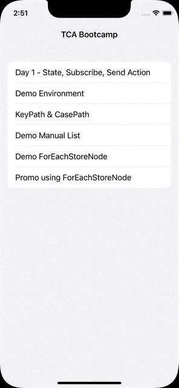
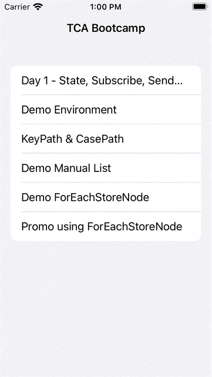
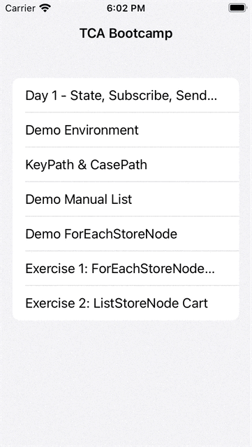
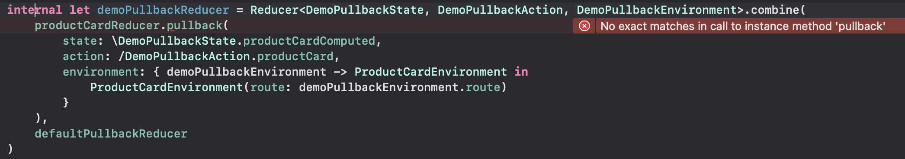

# Day 2: The Rest of TCA

## ForEachStoreNode: Handling list of items never been this easy!



On the demo page, you can see we do the CRUD (Create read update delete) from the list of items.

First we tried to create the page manually using the array of Nodes encapsulated by `ASScrollNode`.

You can see the code in the `ManualLoopVC.swift` and focus on the `updateState` function.

```swift
private func updateState(state: ManualLoopModel) {
    self.state = state
    nodes = state.items.map { item in
        let node = ManualTextNode(state: item)
        node.onTapToggle = { [weak self] in
            self?.setSelected(id: item.id)
        }
        node.onTapRemove = { [weak self] in
            self?.remove(id: item.id)
        }
        return node
    }
    scrollNode.setNeedsLayout()
}
```

The code will called everytime you change the `state`, to keep the UI sync with the state. This code is not efficient, as if you do something on the state, it'll create the whole new nodes. To improve the code, you need to add extra logic to diffing the old and new value, and only rerender/update on the node that has different value from the old one.

That logic could be difficult and repeated by other feature/developers. This is one of the reason why we create ForEachStoreNode.

ForEachStoreNode is a node that uses store as its backbone and will handle the diffing for you automatically.

Let's try to convert it to use ForEachStoreNode.

First, we set the State.
```swift
struct DemoForEachState: Equatable {
    var stackData: IdentifiedArrayOf<DemoItemState> = []
    var lastId: Int = 0 // used for keep tracking of the last id
}

struct DemoItemState: Equatable, Identifiable {
    var id: Int
    var text: String
    var isActive: Bool
}
```

There is new type of data: `IdentifiedArray`.

IdentifiedArray is commonly used in collection of TCA because it's like the Array with the benefit of accessing the ids like Dictionary. 

Let's try it:
```swift
var states = DemoItemState.mocks(numberOfMocks: 10)
var identifiedArrayStates = IdentifiedArrayOf(DemoItemState.mocks(numberOfMocks: 10))

// modify states of id 2
if let index2 = states.firstIndex(where: { $0.id == 2 }) {
    states[index2].isActive.toggle()
}
identifiedArrayStates[id: 2]?.isActive.toggle()

// removing id 3
states.removeAll { $0.id == 3 }
identifiedArrayStates.remove(id: 3)
```

In regular array the complexity of modify and removing the item by our identifier is O(n), on the other hand, it just O(1) on IdentifiedArray.

We need to conform to `Identifiable` protocol to use the IdentifiedArray.

Let's move on to the Action.

```swift
enum DemoForEachAction: Equatable {
    case didLoad
    case shuffle
    case addItem
    case child(id: Int, action: DemoItemAction)

    /// Side Effect
    case receiveData([DemoItemState])
}
```

We can focus on the `case child`, because this is the new pattern that will heavyly used on array of store (ForEachStoreNode).

The pattern is for array of store action, we provide the id, and the node Action.

The type of id is depend on its State id counterpart. (in this case the `DemoItemState`'s id is `Int`, so we make the id `Int`)

The id is needed so you will know in which state the action is performed.

Next, let's implement the reducer:
```swift
let demoForEachReducer = Reducer<DemoForEachState, DemoForEachAction, DemoForEachEnvironment> { state, action, env in
    switch action {
    case .didLoad:
        return env.loadData()
            .map(DemoForEachAction.receiveData)
            .eraseToEffect()
    case let .receiveData(data):
        state.stackData = IdentifiedArray(data)
        state.lastId = data.count
        return .none
    case .shuffle:
        state.stackData.shuffle()
        return .none
    case .addItem:
        state.lastId += 1
        state.stackData.append(DemoItemState(
            id: state.lastId,
            text: "Data \(state.lastId)",
            isActive: true
        ))
        return .none
    case let .child(id, .remove):
        state.stackData.remove(id: id)
        return .none
    case let .child(id, .toggle):
        state.stackData[id: id]?.isActive.toggle()
        return .none
    }
}
```

The logic has been finished. Let's move on the UI `DemoItemNode` first.
Let's convert `ManualTextNode` to the DemoItemNode, you can copy the implementation to the `DemoForEachVC.swift` and change the name of the class to `DemoItemNode`.

Then change the init to using `Store<DemoItemState, DemoItemAction>`, then change the binding to use the store.

```swift
private func bindState() {
    store.subscribe(\.text)
        .map { NSAttributedString.body2($0) }
        .asDriverOnErrorJustComplete()
        .drive(textNode.rx.attributedText)
        .disposed(by: rx.disposeBag)

    store.subscribe(\.isActive)
        .asDriverOnErrorJustComplete()
        .drive(onNext: { [isActiveButton] isActive in
            isActiveButton.setTitle(isActive ? "✅" : "❌", with: .body1(), with: .n700A96, for: .normal)
            self.setNeedsLayout()
        })
        .disposed(by: rx.disposeBag)
}

private func bindAction() {
    isActiveButton.rx.tap.asDriverOnErrorJustComplete()
        .drive(onNext: { [store] in
            store.send(.toggle)
        })
        .disposed(by: rx.disposeBag)

    removeButton.rx.tap.asDriverOnErrorJustComplete()
        .drive(onNext: { [store] in
            store.send(.remove)
        })
        .disposed(by: rx.disposeBag)
}
```

Let's go to main portion, implementing the `ForEachStoreNode`.

When creating the ForEachStoreNode, we need three things:
```swift
public convenience init(
    store: Store<State, (State.Element.IdentifierType, Action)>,
    layoutSpecOptions: LayoutSpecOptions = .init(),
    node: @escaping (Store<State.Element, Action>) -> ASDisplayNode
)
```

Let's talk about one by one:
- store: `Store<State, (State.Element.IdentifierType, Action)>`

The `State` type should be a `Collection` (as its stated in the init type constraint). the action is a tuple `(State.Element.IdentifierType, Action)`, if you may remember, this is the same pattern we used on the action `child`.
```swift
case child(id: Int, action: DemoItemAction)
```
The id is the State.Element.IdentifierType which is `Int`. and the action is `DemoItemAction`.
- layoutSpecOptions is a parameter to configure the layouting (such as spacing, direction, etc)
- node: The closure that convert the given `Store` to the node. The Store type is `Store<State.Element, Action>`, in this demo the State.Element is `DemoItemState` and the action is `DemoItemAction`

```swift
private lazy var nodes = ForEachStoreNode(
    store: self.store.scope(
        state: \.stackData,
        action: DemoForEachAction.child
    ),
    layoutSpecOptions: LayoutSpecOptions(stackDirection: .vertical)
) { eachStore in
    DemoItemNode(store: eachStore)
}
```

You can further simplify the code to:
```swift
private lazy var nodes = ForEachStoreNode(
    store: self.store.scope(
        state: \.stackData,
        action: DemoForEachAction.child
    ),
    layoutSpecOptions: LayoutSpecOptions(stackDirection: .vertical),
    node: DemoItemNode.init
)
```

## Exercise 1: Promo List Page



We've provide skeleton of the UI. So you can focus on the TCA part.
File: `PromoListVC.swift`

First, we implement the State and Action

```swift
struct PromoListState: Equatable {
    var selectedPromoId: String?
    
    var selectedPromoState: PromoState? {
        selectedPromoId.flatMap { promos[id: $0] }
    }
    
    var promos: IdentifiedArrayOf<PromoState> = []
}

enum PromoListAction: Equatable {
    case didLoad
    case receivePromoListResponse([PromoState])
    case promo(id: String, action: PromoAction)
    case didTapUsePromo
}
```

We use computed property for `selectedPromoState` so we don't have redundant data.

Next, go to the `PromoNode.swift` and implement the state and action binding 
```swift
store.subscribe(\.title)
    .subscribe(onNext: { [titleNode] in
        titleNode.attributedText = .heading2($0)
    })
    .disposed(by: rx.disposeBag)

store.subscribe(\.amount)
    .subscribe(onNext: { [descriptionNode] in
        descriptionNode.attributedText = .display3(String("Discount Rp. \($0)"))
    })
    .disposed(by: rx.disposeBag)

store.subscribe(\.isSelected)
    .subscribe(onNext: { [weak self] isSelected in
        self?.backgroundColor = isSelected ? .GN50 : .baseWhite
    })
    .disposed(by: rx.disposeBag)

// bindAction in didLoad
tapGesture.rx.event
    .asDriver()
    .drive(onNext: { [store] _ in
        store.send(.didTap)
    })
    .disposed(by: rx.disposeBag)
```

Next we implement the reducer
```swift
let promoListReducer = Reducer<PromoListState, PromoListAction, PromoListEnvironment> { state, action, env in
    switch action {
    case .didLoad:
        return env.getPromoList()
            .map(PromoListAction.receivePromoListResponse)
    case let .receivePromoListResponse(promos):
        state.promos = IdentifiedArrayOf(promos)
        state.promos.mutateEach { promoState in
            promoState.isSelected = promoState.id == state.selectedPromoId
        }
        return .none
    case let .promo(id, .didTap):
        state.promos.mutateEach {
            if $0.id == id {
                $0.isSelected.toggle()
            } else {
                $0.isSelected = false
            }
        }
        return .none
    case .didTapUsePromo:
        state.selectedPromoId = state.promos.first(where: \.isSelected)?.id
        return .none
    }
}
```

And lastly, we create the ForEachStoreNode:

```swift
private lazy var promoListNode = ForEachStoreNode(
    store: store.scope(
        state: \.promos, 
        action: PromoListAction.promo
    ),
    node: PromoNode.init
)
```

## ListStoreNode

ListStoreNode is a wrapper to our beloved ASCollectionNode (UICollectionView), that make our code cleaner and more declarative.

The implementation is very similar to the `ForEachStoreNode`.

Let's try to change our `DemoForEachVC` to use `ListStoreNode` instead.

PS: You only need to change the VC!

First, you can remove the scrollNode because collection already has one. Then you can directly return the `nodes` in the `node.layoutSpecBlock`
```swift
node.layoutSpecBlock = { [weak self] _, _ in
    guard let self = self else { return ASLayoutSpec() }

    return ASWrapperLayoutSpec(layoutElement: self.nodes)
}
```

Then we rename from ForEachStoreNode into ListStoreNode, and remove the `layoutSpecOptions` parameter.

Run the app, the UI is showing but in incorrect layout. The reason is behind the scene, the ListStoreNode will use `UICollectionViewFlowLayout()` as its `collectionViewLayout` parameter. If you want to make it fully occupied the width of the screen, you can try to use our `CustomizableLayout`.

Please provide the `collectionViewLayout` in ListStoreNode initialization.
```swift
private lazy var nodes = ListStoreNode(
    store: self.store.scope(
        state: \.stackData,
        action: DemoForEachAction.child
    ),
    collectionViewLayout: CustomizableLayout.Template.verticalListLayout(spacing: 8, margins: .zero)
) { store in
    DemoItemNode(store: store)
}
```

How cool is that? You just change 2 lines of code, and the convertion is done 😎

I'll not explaining CutomizableLayout because it's out of scope of this bootcamp.

## Exercise 2: Cart Page

To get used to the list (ListStoreNode and ForEachStoreNode), we will do the one more exercise of ListStoreNode.



The cart consist of list of products that can be toggled, removed, and change its quantity.

At the bottom it shows total price of the selected products.

As the state is straighforward, let's jump in to the action and the reducer.
We can translate the requirement of the feature (what user can do in the page) into the action.

```swift
enum ShopProductAction: Equatable {
    case didTapToggle
    case didTapPlus
    case didTapMinus
    case didTapDelete
    case textDidChange(String)
}
```

We hit the API when the page is loaded. Next as usual pattern, we create a `product` enum Action inside the `CartPageAction`.

```swift
enum CartPageAction: Equatable {
    case didLoad
    case receiveCartData(Result<[ShopProductState], NetworkError>)
    case product(id: Int, action: ShopProductAction)
}
```

Then we can implement the reducer:
```swift
let cartPageReducer = Reducer<CartPageState, CartPageAction, CartPageEnvironment> { state, action, env in
    switch action {
    case .didLoad:
        return env.getCartData()
            .map(CartPageAction.receiveCartData)
    case let .receiveCartData(result):
        switch result {
        case let .success(products):
            state.products = IdentifiedArrayOf(products)
            return .none
        case let .failure(error):
            return .none
        }
    case let .product(id, .didTapToggle):
        state.products[id: id]?.isActive.toggle()
        return .none
    case let .product(id, .didTapPlus):
        state.products[id: id]?.quantity += 1
        return .none
    case let .product(id, .didTapMinus):
        state.products[id: id]?.quantity -= 1
        return .none
    case let .product(id, .didTapDelete):
        state.products.remove(id: id)
        return .none
    case let .product(id, .textDidChange(string)):
        state.products[id: id]?.quantity = Int(string) ?? 0
        return .none
    }
}
```

For the total price we can leverage the computed property.
```
struct CartPageState: Equatable {
    var products: IdentifiedArrayOf<ShopProductState> = []
    var totalPrice: Int {
        products.reduce(into: 0) { partialResult, state in
            if state.isActive {
                partialResult += (state.quantity * state.price)
            }
        }
    }
}
```
Then we create the ListStoreNode

```swift
private lazy var shopNode = ListStoreNode(
    store: store.scope(state: \.products, action: CartPageAction.product),
    collectionViewLayout: CustomizableLayout.Template.verticalListLayout(spacing: 0, margins: .zero),
    content: ShopProductNode.init
)
```

Last, implement the binding for both `CartPageVC` and `ShopProductNode`.
```swift
// CartPageVC
private func bindState() {
    store.subscribe(\.totalPrice)
        .map {
            let string = NumberFormatter.currencyFormatter().string(for: $0) ?? ""
            return NSAttributedString.heading2("""
            Total Price:
            \(string)
            """)
        }
        .subscribe(totalPriceTextNode.rx.attributedText)
        .disposed(by: rx.disposeBag)
}

// ShopProductNode
private func bindAction() {
    minusBtn.rx.tap.asDriver()
        .drive(onNext: { [store] in
            store.send(.didTapMinus)
        })
        .disposed(by: rx.disposeBag)

    plusBtn.rx.tap.asDriver()
        .drive(onNext: { [store] in
            store.send(.didTapPlus)
        })
        .disposed(by: rx.disposeBag)
    
    deleteButton.rx.tap.asDriver()
        .drive(onNext: { [store] in
            store.send(.didTapDelete)
        })
        .disposed(by: rx.disposeBag)
    
    toggleNode.rx.isSelected
        .asDriver()
        .drive(onNext: { [store] _ in
            store.send(.didTapToggle)
        })
        .disposed(by: rx.disposeBag)

    textFieldNode.rx.text
        .asDriver()
        .drive(onNext: { [store] text in
            store.send(.textDidChange(text))
        })
        .disposed(by: rx.disposeBag)
}

private func bindState() {
    store.subscribe(\.name)
        .map { NSAttributedString.heading3($0) }
        .subscribe(nameTextNode.rx.attributedText)
    
    store.subscribe(\.quantity)
        .map(String.init)
        .subscribe(textFieldNode.rx.text)
        .disposed(by: rx.disposeBag)
    
    store.subscribe(\.price)
        .map {
            let string = NumberFormatter.currencyFormatter().string(for: $0) ?? ""
            return NSAttributedString.display3(string)
        }
        .subscribe(priceNode.rx.attributedText)
        .disposed(by: rx.disposeBag)
    
    store.subscribe(\.isActive)
        .subscribe(toggleNode.rx.isSelected)
        .disposed(by: rx.disposeBag)
}
```

### When to use ForEachStoreNode and ListStoreNode

If you have lots of item and need Collection functionality, please use `ListStoreNode`, otherwise you can choose both of them.

## KeyPath & CasePath

### Short story of KeyPath

Branch: `bootcamptca-day2/1-starting_point`

KeyPath is created to make the code more dynamic. We will not explained the detail of the KeyPath here, just a bit introduction before we introduce you to `CasePath`.

Let said we have the `SecureModel`

```swift
struct SecureModel {
    var userId: Int
    var name: String
    var age: Int
    var deviceToken: String
}
```

When we need to mutate the property, usually we did this:
```
var model = SecureModel(userId: 1, name: "John Doe", age: 25, deviceToken: "myToken")
// to get value
print(model.deviceToken)

// to update value
model.deviceToken = "New Updated Token"
```

The other way to modify the property is by using KeyPath. E.g:

```swift
let deviceTokenKeyPath = \SecureModel.deviceToken // type: WritableKeyPath<SecureModel, String>

// to get value
print(model[keyPath: deviceTokenKeyPath])

// to update value
model[keyPath: deviceTokenKeyPath] = "New Updated Token from Keypath" // Write
```

It's more difficult than the usual way (direct mutate), so what the purpose of KeyPath? The keyword is "dynamic". Let's check our simplified `SecureStorage` class that storing the sensitive data in the keychain.

```swift
class SecureStorage {
    private var model = SecureModel(userId: 1, name: "John Doe", age: 25, deviceToken: "myToken")
    func getSecureData() -> SecureModel {
        return model
    }
}
```

This class/struct is used in many places (networking, user notification, user profile, etc). All the properties is stored in the single model (SecureModel).
Let said the UserNotification page want to update the deviceToken. This page doesn't care about other property. If you using usual way of get and mutate the property, you need to add function to mutate the deviceToken inside the SecureStorage class like this.

```swift
class SecureStorage {
	// ...
	func updateDeviceToken(newToken: String) {
		model.deviceToken = newToken
	}
}
```

and you need to provide function for all the property, such as userId, name, and age. You need `N` number of function on `N` properties. Previously this can be fixed by change the SecureModel to a dictionary.

```swift
class SecureStorage {
	var model: [String: Any]

	func update(key: String, value: Any) {
		model[key] = value
	}
}

// usage
SecureStorage().update(key: "deviceToken", value: "New Token Value")
```

But as you may know, the dictionary is not type safe. What happen when the key is not found when you are trying to get? What happen when you make typo, for example you want to update the `deviceToken`, but you type `devicetoken` (without capital `T` in token). What if you store the wrong value in that key? You need to cast to your intended value (such as `as? String` or `as? MyModel`). The compiler can't check the validity of the type

This is one of the use case I found that is a good candidate to use KeyPath.

```swift
class SecureStorage {
    private var model = SecureModel(userId: 1, name: "John Doe", age: 25, deviceToken: "myToken")
    func getSecureData() -> SecureModel {
        return model
    }
    
    func setSecureData<Value>(keyPath: WritableKeyPath<SecureModel, Value>, value: Value) {
        print("try to change \(keyPath) to \(value)")
        model[keyPath: keyPath] = value
    }
}
```

Using KeyPath, the compiler can type check the key and the value, so you'll never get the issue of miss type or miss add/update value on the specific key.

```swift
let secureManager = MySecureData()
print(secureManager.getData(keyPath: \.deviceToken))
secureManager.setSecureData(keyPath: \.deviceToken, value: "new Token")
print(secureManager.getData(keyPath: \.deviceToken))
```

Will print:
```
myToken
try to change Swift.WritableKeyPath<TCABootcamp.SecureModel, Swift.String> to new Token
new Token
```

The summary is, keyPath is used to store the metadata of Key and Value so we can dynamicly get and update the property.

### CasePath
CasePath is created by PointFree team to achieve the same thing as KeyPath.
As Apple still doesn't have the KeyPath for enum.

I still can't find the great usage in my mind to explained to you guys how the CasePath can help with the code.

So I'll explained what the main point of CasePath is by showing this code.

```swift
struct ShopRegular {
    var shopId: Int
    var name: String
}

struct ShopPowerMerchant {
    var shopId: Int
    var benefit: [String]
}

struct ShopOfficialStore {
    var shopId: Int
    var adminIds: [Int]
    var closedTime: String
}

enum ShopType {
    case regular(ShopRegular)
    case powerMerchant(ShopPowerMerchant)
    case officialStore(ShopOfficialStore)
}
```

The CasePath main function is the same as keyPath, which is:
1. get (in CasePath, the terminology is `extract`). You `extract` the `ShopType` to get the `ShopRegular`
2. set (in CasePath, it is `embed`). You `embed` the `ShopRegular` inside the `ShopType`

Let said we want to do something when the shopType is regular. how do you get and set the value to the `ShopType`?

```swift
func changeShopNameIfRegular(_ shopType: inout ShopType) {
	// get
	guard case var .regular(shopRegular) = shopType else { return nil }

	shopRegular.name = "UpdatedName"

	// set
	shopType = .regular(shopRegular)
}

var regularShopType = ShopType.regular(ShopRegular.mock)
changeShopNameIfRegular(&regularShopType)
print(regularShopType) // the name will change to "UpdatedName"

var officialStoreType = ShopType.officialStore(ShopOfficialStore.mock)
changeShopNameIfRegular(&regularShopType)
print(officialStoreType) // will not change
```

Let's try to use CasePath for the `changeShopNameIfRegular` function.
```swift
func changeShopNameIfRegular(_ shopType: inout ShopType) {
	// get
	guard var shopRegular = (/ShopType.regular).extract(from: shopType) else { return nil }

	shopRegular.name = "UpdatedName"

	// set
	shopType = (/ShopType.regular).embed(shopRegular)
}
```

The code is similar, so what's the benefit? The same as KeyPath, if you do the specific things, there is no huge benefit of using CasePath. The benefit is more clear when you are doing more broad helper, for example the modify

```swift
extension CasePath {
  public func modify<Result>(
    _ root: inout Root,
    _ body: (inout Value) throws -> Result
  ) throws -> Result {
    guard var value = self.extract(from: root) else { throw ExtractionFailed() }
    let result = try body(&value)
    root = self.embed(value)
    return result
  }
}
```

That function can be used for every CasePath we have, let's update our `changeShopNameIfRegular` to uses the new `modify` helper.

```swift
func changeShopNameIfRegular(_ shopType: inout ShopType) {
	try? (/ShopType.regular).modify(&shopType) {
        // modify
        $0.name = "Updated Name using CasePath modify"
    }
}
```

The code is much much simpler, because of the generic CasePath that know how to get (extract) and set (embed), the modify function can do both of them automatically, and you can focus on modifying the value.

The CasePath will used multiple times in our upcoming demos and exercises.

## Reducer.pullback
The purposes of pullback is to support composing different reducer. You are like pulling the small reducer into the bigger one.

Example: DemoPullbackVC.swift


First, we create new `productCardReducer` that encapsulate all logic related to product card.
```swift
let productCardReducer = Reducer<ProductCardState, ProductCardAction, ProductCardEnvironment> { state, action, env in
    switch action {
    case .didTap:
        return env.route(state.url)
            .fireAndForget()
    case .didTapWishlist:
        state.isWishlist.toggle()
        return .none
    }
}
```
Then, rename the `demoPullbackReducer` into `private let defaultReducer`.

After that, we combine both reducer into one `demoPullbackReducer`

```swift
let demoPullbackReducer = Reducer<DemoPullbackState, DemoPullbackAction, DemoPullbackEnvironment>.combine(
    productCardReducer,
    defaultReducer
)
```

The code won't compile, and a fresh new error shown in xcode editor:
```
❌ Cannot convert value of type 'Reducer<ProductCardState, ProductCardAction, ProductCardEnvironment' to expected argument type 'Reducer<DemoPullbackState, DemoPullbackAction, DemoPullbackEnvironment>'
```

This is expected because the `productCardReducer` and `defaultReducer` have different signature (State, Action, and even the Environment is different).

The fix is by `pullback` the `productCardReducer` to the parent reducer. we need to provide three parameters inside the reducer, which are:

```swift
productCardReducer.pullback(
    state: WritableKeyPath<GlobalState, ProductCardState>,
    action: CasePath<GlobalAction, ProductCardAction>,
    environment: (GlobalEnvironment) -> ProductCardEnvironment
)
```

You can think `GlobalState` as `DemoPullbackState`, `GlobalAction` as `DemoPullbackAction`, and `GlobalEnvironment` as `DemoPullbackEnvironment`

Let me explained each parameter:
1. State. This is quite similar with scope, but it only accept WritableKeyPath, not a closure. This is because the pullback will do the get and set.
You can use 
```swift
state: \.productCard
```

2. Action. This is the first time you see the CasePath is used. The reason is similar, the reducer will need to get (extract) and set (embed) the action.

```swift
action: /DemoPullbackAction.productCard
```

3. Environment. This is where you can transform the given Environment into the needed one.
```swift
(GlobalEnvironment) -> ProductCardEnvironment
```

The `productCardReducer` only need route, so we can give it from the parentEnv.
```swift
environment: { parentEnv in
	ProductCardEnvironment(route: parentEnv.route)
}
```

Combine it together, you get the desired Reducer type (same as defaultReducer), so you can combine it now.
```swift
let demoPullbackReducer = Reducer<DemoPullbackState, DemoPullbackAction, DemoPullbackEnvironment>.combine(
    productCardReducer.pullback(
        state: \.productCard,
        action: /DemoPullbackAction.productCard,
        environment: { _ in
            .mock
        }
    ),
    defaultReducer
)
```

⚠️ You may see the code in the production like this in the pullback environment:

```swift
environment: { _ in
	ProductCardEnvironment.mock
}
```

That code can run normally, but there is a downside, which is you can't mock that, whatever Environment you gave to the Parent, the ChildEnvironment will always return its own. We discourage you to use this style.

To demonstrate the problem, let's try to use that code, and then move to the unit test of `DemoPullbackVCReducerTests`, and add test when tapping the product card.
```swift
func testTapTheProduct() {
    let testStore = TestStore(
        initialState: DemoPullbackState(information: "", productCard: .mock),
        reducer: demoPullbackReducer,
        environment: .failing
    )
    
    testStore.send(.productCard(.didTap))
}
```

Run the test and the test is succeed eventhough we provide `.failing` environment and didTap action call the environment, it is not triggering the Effect.failing.

As described before, because the productCardReducer.pullback always use the mock version, we don't have the ability to change the implementation, or you can say we can't control the world anymore.

Let's change back the implementation to 
```swift
environment: { parentEnv in
	ProductCardEnvironment(route: parentEnv.route)
}
```

And rerun the test. We get the expected failed test now 😁
```
❌ Should not call route - A failing effect ran.
```

Let's implement the `route` in the environment and assert it with the help of `routeSink`.

```swift
func testTapTheProduct() {
    var routeSink = [String]()
    let testStore = TestStore(
        initialState: DemoPullbackState(information: "", productCard: .mock),
        reducer: demoPullbackReducer,
        environment: .failing
    )
    
    testStore.environment.route = { url in
        .fireAndForget {
            routeSink.append(url)
        }
    }
    
    testStore.send(.productCard(.didTap))
    XCTAssertEqual(routeSink, [ProductCardState.mock.url])
}
```

The test now run successfully.

✅ The best practice is ParentEnvironment has all the ChildEnvironment property.

You may experiencing error when doing pullback and the error message is not helpful because Xcode can't infer it. My tips to overcome this issue is to refactor your pullback to the variable. Example:


```
❌ No exact matches in call to instance method 'pullback'
```

You can first refactor it to:
```swift
let pullbackReducer: Reducer<DemoPullbackState, DemoPullbackAction, DemoPullbackEnvironment> = productCardReducer.pullback(
    state: \DemoPullbackState.productCardComputed,
    action: /DemoPullbackAction.productCard,
    environment: { demoPullbackEnvironment -> ProductCardEnvironment in
        ProductCardEnvironment(route: demoPullbackEnvironment.route)
    }
)
```

The error will be more informative:
```
❌ Cannot convert value of type 'WritableKeyPath<DemoPullbackState, ProductCardState?>' to expected argument type 'WritableKeyPath<DemoPullbackState, ProductCardState>'
```

That error will guide you to know which part that cause the problem.


Exercise: Refactor `CounterNode`

The `CounterNode` has been used twice, in the `OrderVC` (on day 1 exercise) and actually `CartPageVC` uses the similar UI in it's `ShopProductNode`. So let's refactor it.

First, we create CounterNode it's own reducer, named: `counterReducer`. Then move all the logic of the counter into that reducer.

// Continue

## Reducer.optional

Branch: 

Demo: Wishlist BottomSheet
Exercise: Add Capabilities to choose promo in the CartPage.

Provide 3 Quiz for pullback exercise

// Showing that how forEach/optional/pullback can reduce repeated code

```swift
struct ParentState {
	var childState: ChildState?
}

switch action {
	case .childOptional(.didTap):
		guard let childState = state.childState else { return .none }
		// do something with childState
	case .childOptional(.didDoX):
		guard let childState = state.childState else { return .none }
		// do something with childState
}

// using smaller reducer
switch action {
	case .didTap:
		state.x // state is already non optional ChildState
}
```

## Reducer.forEach
Example: DemoForEachVC
Let's try to refactor the reducer with array type.

Exercise: CartPageVC

## ListStoreNode with SwitchCaseStoreNode

Let said you have several types of cell in the Collection, you can do that too in the ListStoreNode with the help of `SwitchCaseStoreNode`.

Let's modify the PromoListVC, so it can display the ads cell as well.
First, we create an enum to stored that different types of cell State.

```swift
struct AdsState: Equatable {
    var name: String
}

enum ItemCellType: Equatable, Identifiable {
    case promo(PromoState)
    case ads(AdsState)
    
    var id: String {
        switch self {
        case .promo(let promoState):
            return promoState.id
        case .ads(let adsState):
            return adsState.name
        }
    }
}
```

The `ItemCellType` need to conform to Identifiable because we want to used it as the State type of the ForEachStoreNode/ListStoreNode.

Then we create the simple the AdsAction and the AdsNode
```swift
enum AdsAction: Equatable {
    case didTap
}

final class AdsNode: ASDisplayNode {
    private let imageNode: ASImageNode = {
        let image = ASImageNode()
        image.image = UIImage(unifyIcon: .promo_ads_filled)
        image.style.preferredSize = CGSize(squareWithSize: 40)
        return image
    }()
    private let titleNode = ASTextNode2()
    private let store: Store<AdsState, AdsAction>
    init(store: Store<AdsState, AdsAction>) {
        self.store = store
        super.init()
        automaticallyManagesSubnodes = true
        bindState()
    }
    
    private func bindState() {
        store.subscribe(\.name)
            .subscribe(onNext: { [titleNode] in
                titleNode.attributedText = .heading2("This is Ads for \($0)")
            })
            .disposed(by: rx.disposeBag)
    }
    
    override func didLoad() {
        super.didLoad()
        let tapGesture = UITapGestureRecognizer()
        tapGesture.rx.event
            .asDriver()
            .drive(onNext: { [store] _ in
                store.send(.didTap)
            })
            .disposed(by: rx.disposeBag)
        view.addGestureRecognizer(tapGesture)
    }
    
    override func layoutSpecThatFits(_ constrainedSize: ASSizeRange) -> ASLayoutSpec {
        let stack = ASStackLayoutSpec(direction: .horizontal, spacing: 4, justifyContent: .start, alignItems: .stretch, children: [imageNode, titleNode])
        return ASInsetLayoutSpec(insets: UIEdgeInsets(insetsWithInset: 4), child: stack)
    }
}
```


## Enum State & SwitchCaseStoreNode
Skipped

## Extra: Form Binding
Skipped
